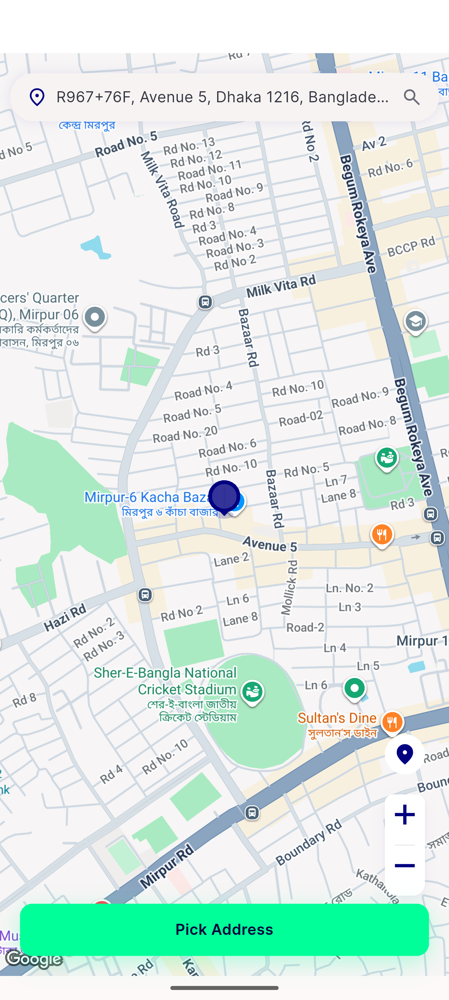
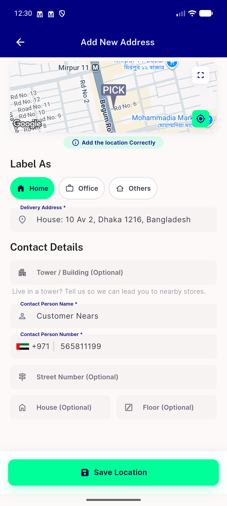
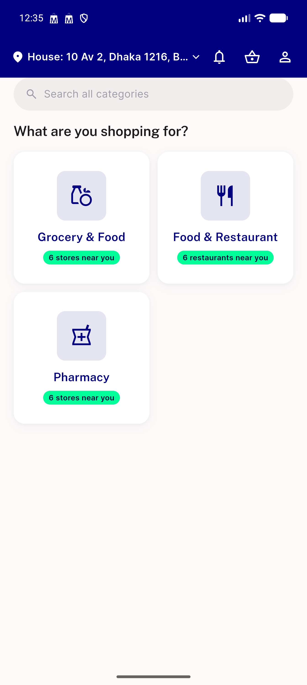

# QA Evidence — NEARS-2493

**PASS - NEARS-2493 getZone race guard: AC1/AC2/AC3 verified live + unit-test backstop, zero regressions on shared LocationController.getZone chokepoint**

**3 screenshot(s).** Click any thumbnail for full resolution.

<table>
<tr>
<td align="center" width="33%"> ac1 ac2 canonical pickmap race final state</td>
<td align="center" width="33%"> ac1 ac2 pick map overlap final state</td>
<td align="center" width="33%"> bug earnings group missing open vendor row</td>
</tr>
</table>

---
*From `nears/docs/qa-evidence/NEARS-2493/` · public-repo scrub policy (no live secrets; verified clean).*
