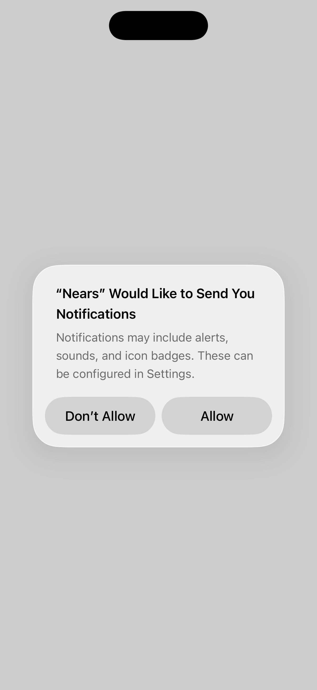

# QA Evidence — NEARS-2501

**FAIL — AC2 unverifiable (backend track_order() has no success-path log line to correlate against laravel.log); AC1 substantively verified live (no misroute, 3/3 attempts) via VM-Service evaluate given Android-pool saturation + iOS-sim cross-session contention**

**1 screenshot(s).** Click any thumbnail for full resolution.

<table>
<tr>
<td align="center" width="33%"> ac1 order tracking 170</td>
</tr>
</table>

### Other artifacts
- [`ac1-source-discriminator.log`](ac1-source-discriminator.log)
- [`bug-ac2-be-log-gap.log`](bug-ac2-be-log-gap.log)
- [`bug-mobile-tracking-screen-no-order-id-text.log`](bug-mobile-tracking-screen-no-order-id-text.log)

---
*From `nears/docs/qa-evidence/NEARS-2501/` · public-repo scrub policy (no live secrets; verified clean).*
