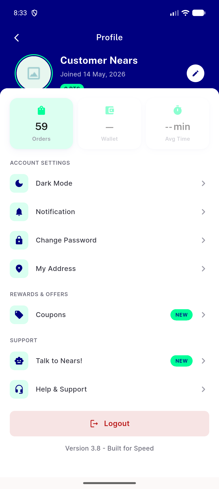
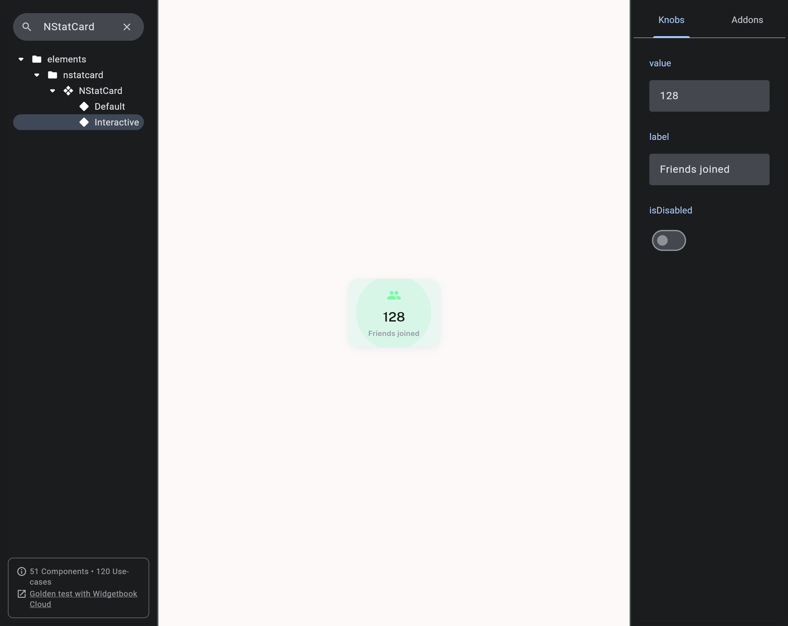

# QA Evidence — NEARS-2503

**PASS — NStatCard interactive onTap, ripple dead-zone fix verified live**

**3 screenshot(s).** Click any thumbnail for full resolution.

<table>
<tr>
<td align="center" width="33%"> ac1 profile orders ripple midpress</td>
<td align="center" width="33%"> ac2 refer and earn nontappable</td>
<td align="center" width="33%"> ac5 widgetbook interactive check</td>
</tr>
</table>

---
*From `nears/docs/qa-evidence/NEARS-2503/` · public-repo scrub policy (no live secrets; verified clean).*
