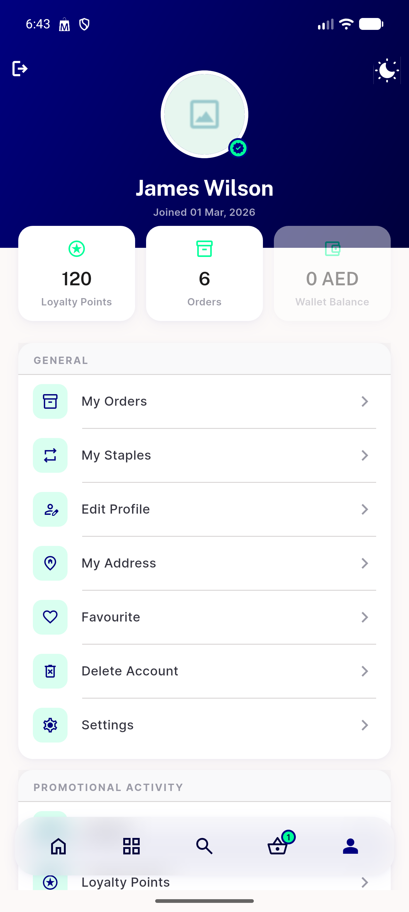
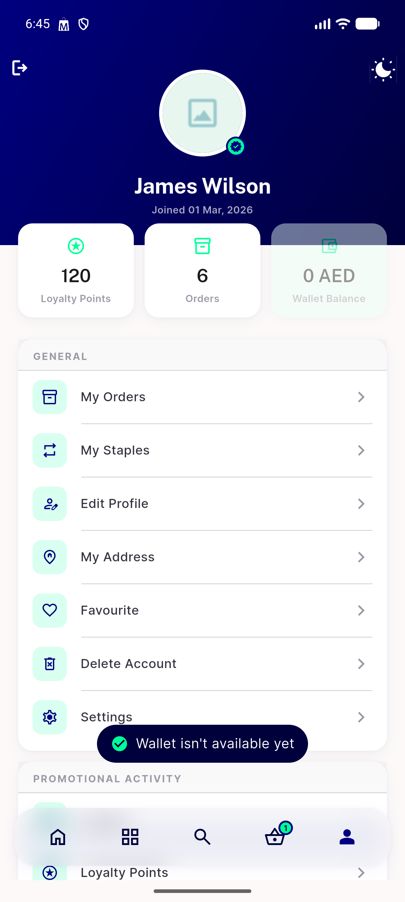
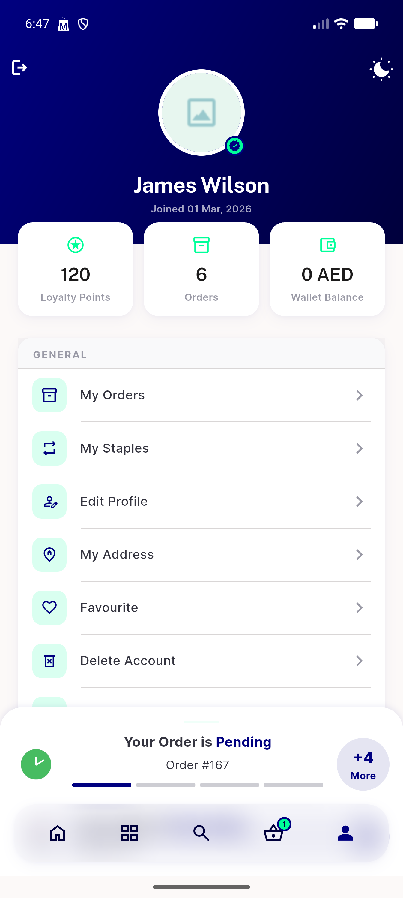
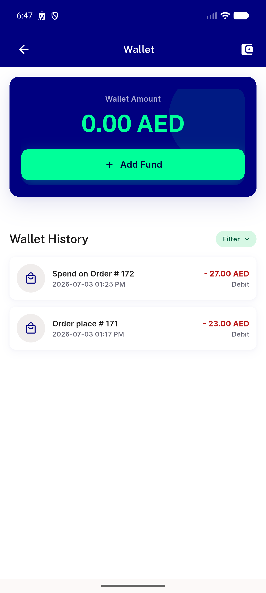
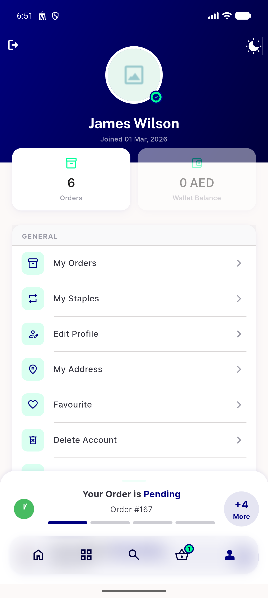
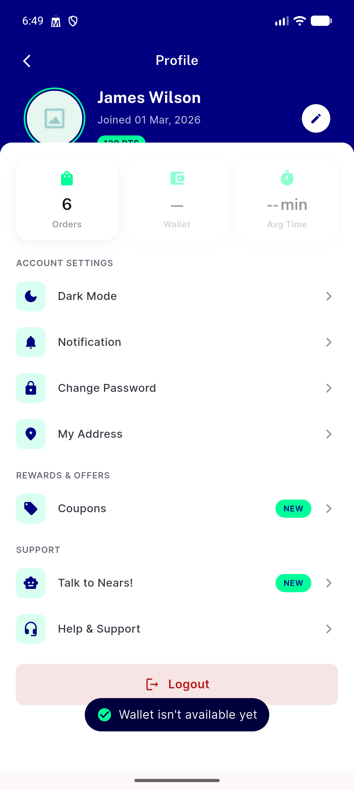

# QA Evidence — NEARS-2504

**PASS — MenuScreen wallet tile now dims (not omits) when disabled, snackbar+no-nav confirmed, cross-screen parity with ProfileScreen confirmed, loyalty-omission regression unaffected**

**6 screenshot(s).** Click any thumbnail for full resolution.

<table>
<tr>
<td align="center" width="33%"> ac1 menuscreen wallet disabled dimmed</td>
<td align="center" width="33%"> ac2 menuscreen wallet tap snackbar</td>
<td align="center" width="33%"> ac3 menuscreen wallet enabled 3 tiles</td>
</tr>
<tr>
<td align="center" width="33%"> ac3 wallet tap navigates</td>
<td align="center" width="33%"> regression loyalty omitted not dimmed</td>
<td align="center" width="33%"> regression profilescreen wallet dimmed snackbar</td>
</tr>
</table>

---
*From `nears/docs/qa-evidence/NEARS-2504/` · public-repo scrub policy (no live secrets; verified clean).*
