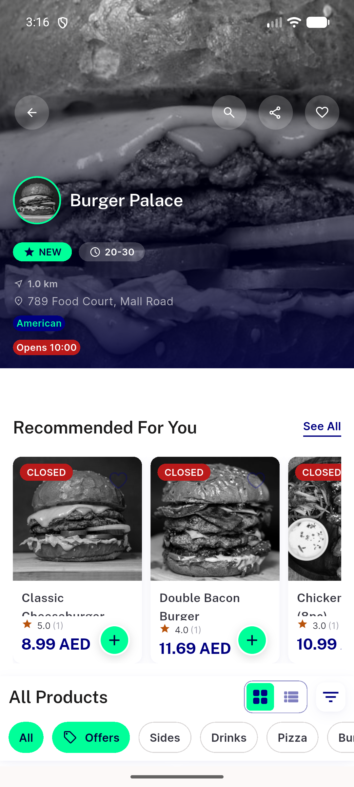
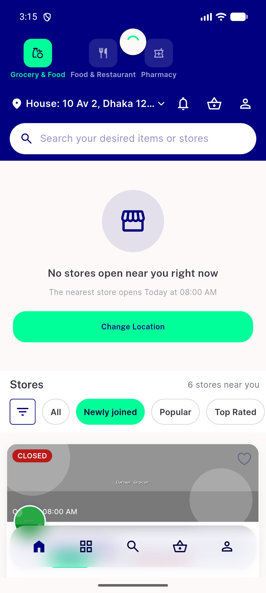
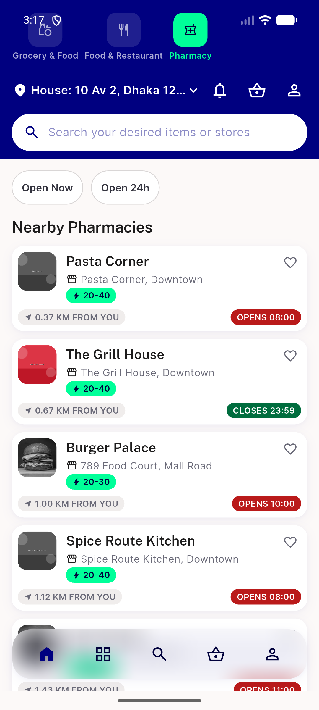

# QA Evidence — NEARS-2505

**PASS — Home fling-settle tap-miss fix confirmed live on device (NModuleRow chip, Favourite toggle onTap delivery, Burger Palace store card), automated backstop 3/3, no regressions**

**3 screenshot(s).** Click any thumbnail for full resolution.

<table>
<tr>
<td align="center" width="33%"> burger palace store detail after midfling tap</td>
<td align="center" width="33%"> home atrest</td>
<td align="center" width="33%"> nmodulerow pharmacy activated after midfling tap</td>
</tr>
</table>

### Other artifacts
- [`favourite-ontap-fired-during-midfling.log`](favourite-ontap-fired-during-midfling.log)

---
*From `nears/docs/qa-evidence/NEARS-2505/` · public-repo scrub policy (no live secrets; verified clean).*
