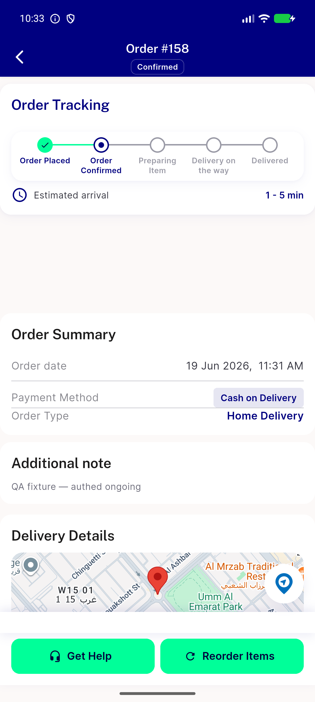
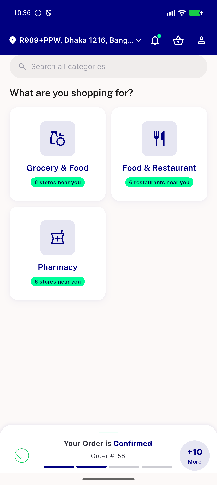

# QA Evidence — NEARS-2507

**PASS — AC1/AC2/AC3 all live-verified cold-launch on emulator-5558; regression_bugs: restaurantId 'vendor1' literal mismatch (pre-existing, static-confirmed)**

**3 screenshot(s).** Click any thumbnail for full resolution.

<table>
<tr>
<td align="center" width="33%"> ac1 cold launch order details</td>
<td align="center" width="33%"> ac2 malformed orderid default screen</td>
<td align="center" width="33%"> ac3 malformed conversationid default screen</td>
</tr>
</table>

### Other artifacts
- [`bug-restaurantid-vendor1-mismatch.log`](bug-restaurantid-vendor1-mismatch.log)

---
*From `nears/docs/qa-evidence/NEARS-2507/` · public-repo scrub policy (no live secrets; verified clean).*
