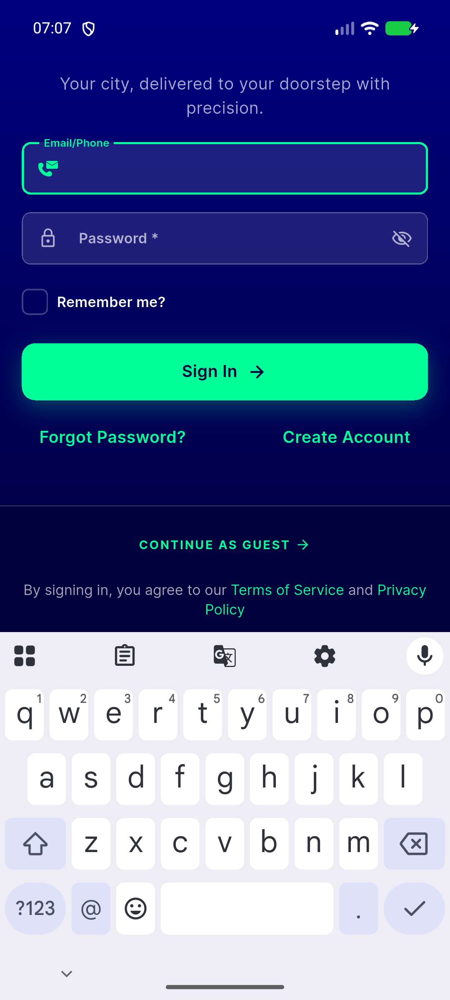
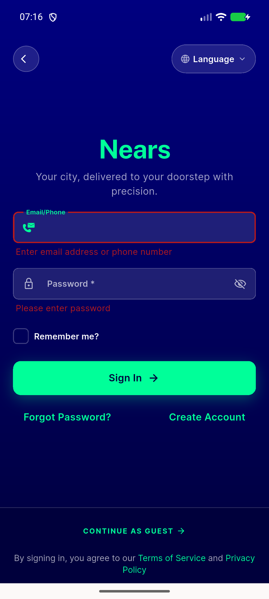
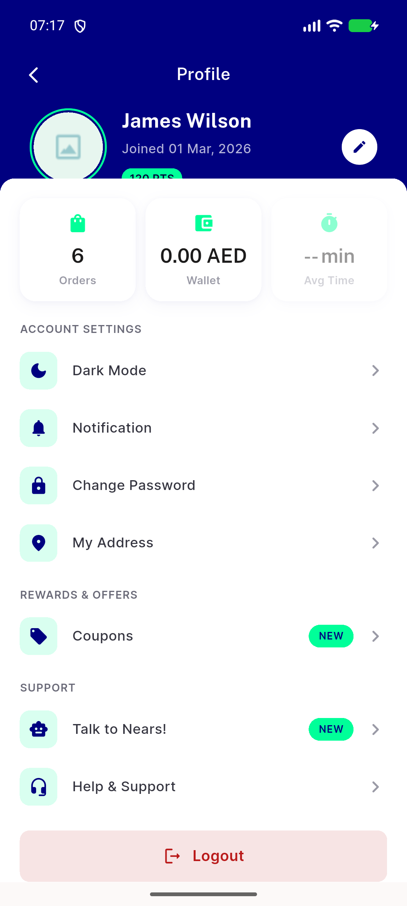
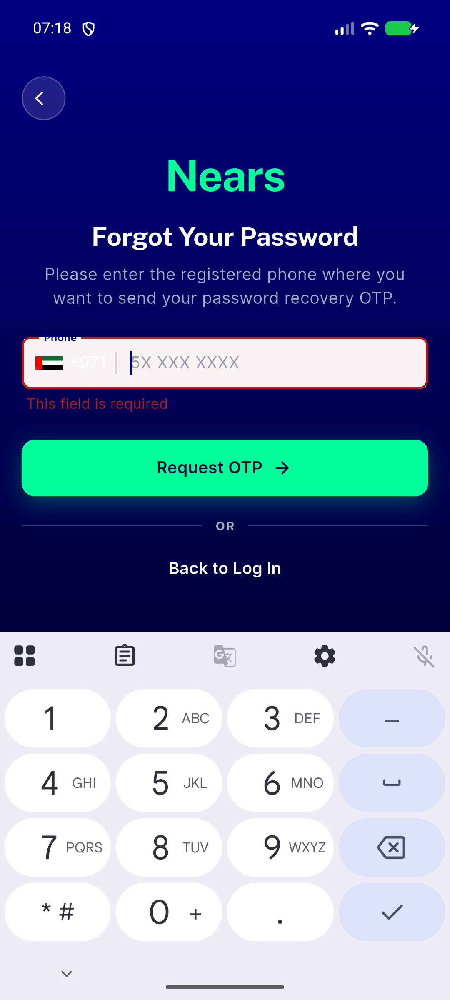
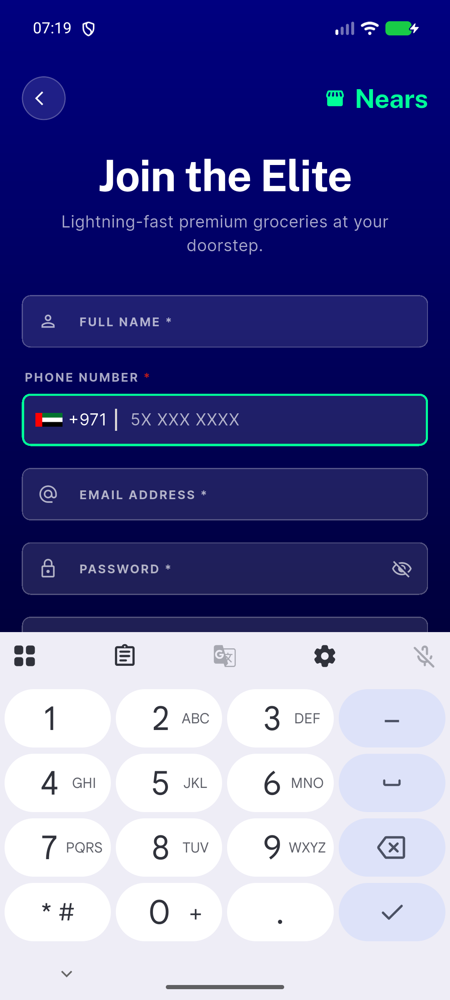

# QA Evidence — NEARS-2513

**PASS — NButton rapid-tap locked-tree fix verified live on emulator-5566, all 3 ACs demonstrated, no regressions**

**5 screenshot(s).** Click any thumbnail for full resolution.

<table>
<tr>
<td align="center" width="33%"> signin screen</td>
<td align="center" width="33%"> ac1 primary post rapid tap stable</td>
<td align="center" width="33%"> ac2 single tap login success</td>
</tr>
<tr>
<td align="center" width="33%"> ac3 tertiary forgot password stable</td>
<td align="center" width="33%"> ac3 tertiary create account stable</td>
</tr>
</table>

---
*From `nears/docs/qa-evidence/NEARS-2513/` · public-repo scrub policy (no live secrets; verified clean).*
