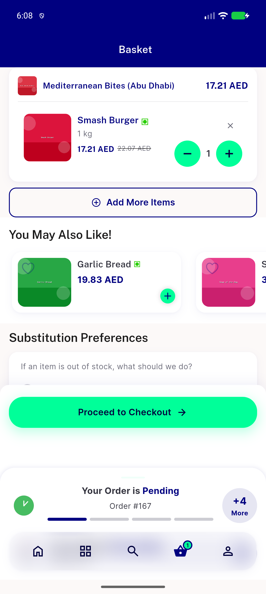

# QA Evidence — NEARS-2515

**PASS - AC1-4 demonstrated live via SIGSTOP/backend-freeze on dedicated backend+DB copy; single server row converges, no double-count, UI matches server, normal ADD unchanged**

**1 screenshot(s).** Click any thumbnail for full resolution.

<table>
<tr>
<td align="center" width="33%"> ac1 3 converged basket</td>
</tr>
</table>

### Other artifacts
- [`ac1-2-sigstop-timeout-reconcile.log`](ac1-2-sigstop-timeout-reconcile.log)
- [`progress.md`](progress.md)

---
*From `nears/docs/qa-evidence/NEARS-2515/` · public-repo scrub policy (no live secrets; verified clean).*
