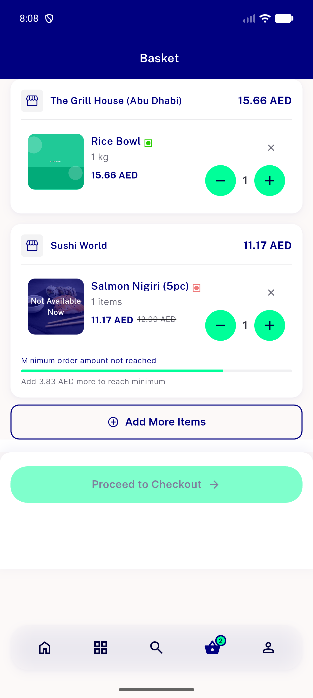
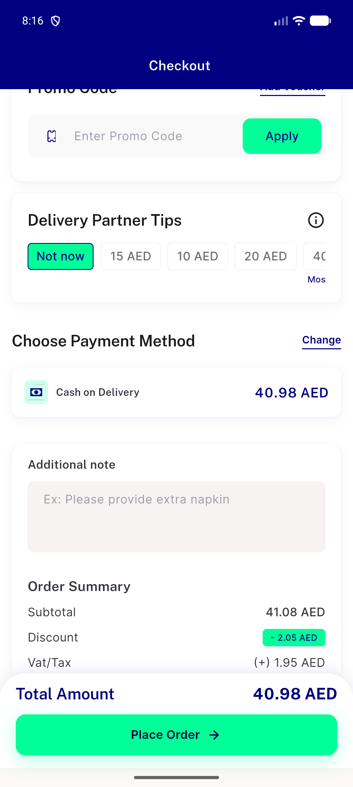
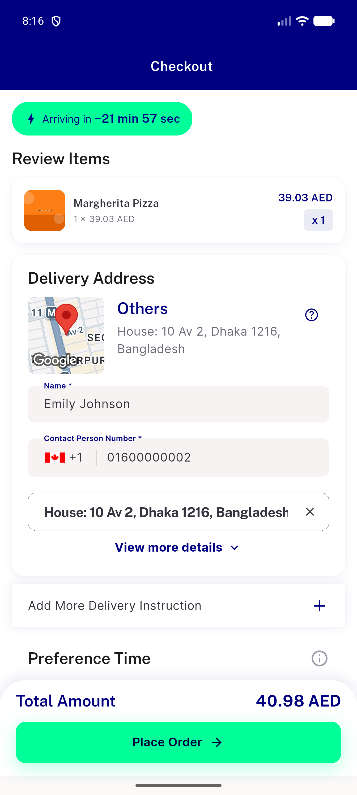

# QA Evidence — NEARS-2516

**PASS - flashsale flip-counter FittedBox overflow fix verified, light mode, AC1+AC2 clean, 3 pre-existing unrelated regressions found**

**8 screenshot(s).** Click any thumbnail for full resolution.

<table>
<tr>
<td align="center" width="33%"> ac item27 1.3xscale ltr</td>
<td align="center" width="33%"> ac item27 1.3xscale rtl</td>
<td align="center" width="33%"> ac item27 defaultscale rtl</td>
</tr>
<tr>
<td align="center" width="33%"> ac1 item27 default ltr</td>
<td align="center" width="33%"> ac2 item27 narrow360dp</td>
<td align="center" width="33%"> regression cart screen</td>
</tr>
<tr>
<td align="center" width="33%"> regression checkout payment ordersummary</td>
<td align="center" width="33%"> regression checkout top</td>
</tr>
</table>

### Other artifacts
- [`bug-bottomcartwidget-renderflex-360dp.log`](bug-bottomcartwidget-renderflex-360dp.log)
- [`bug-crosszone-recommendation-403.log`](bug-crosszone-recommendation-403.log)
- [`bug-itemwidget-renderflex-textscale13.log`](bug-itemwidget-renderflex-textscale13.log)

---
*From `nears/docs/qa-evidence/NEARS-2516/` · public-repo scrub policy (no live secrets; verified clean).*
