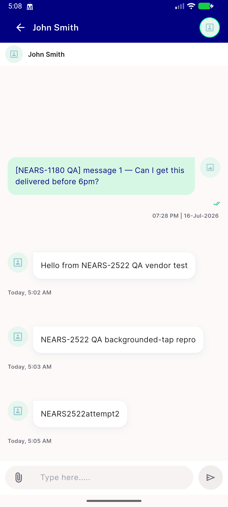

# QA Evidence — NEARS-2522

**QA-lite PASS: vendor chat push restaurantId resolves to 0 (was null), backgrounded-tap onMessageOpenedApp confirmed live on emulator-5564**

**1 screenshot(s).** Click any thumbnail for full resolution.

<table>
<tr>
<td align="center" width="33%"> ac1 chat screen after bg tap</td>
</tr>
</table>

---
*From `nears/docs/qa-evidence/NEARS-2522/` · public-repo scrub policy (no live secrets; verified clean).*
