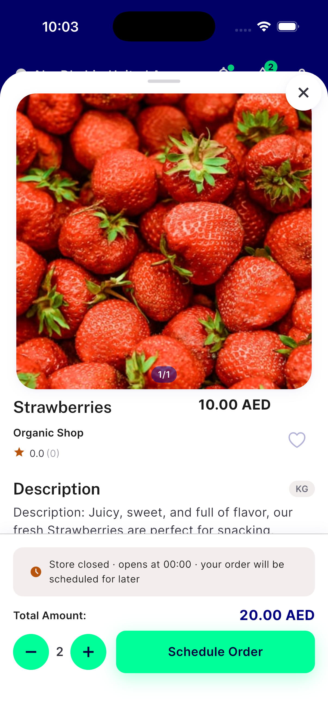

# QA Evidence — NEARS-2533

**PASS -- AC1 rapid-tap-during-locked-frame: clean (no crash/exception); AC2 normal tap: press/release cycle + qty increment confirmed live, no visual regression. iOS sim 53F3807C, iPhone 17 Pro.**

**1 screenshot(s).** Click any thumbnail for full resolution.

<table>
<tr>
<td align="center" width="33%"> ac2 icon button normal tap</td>
</tr>
</table>

### Other artifacts
- [`ac1-rapid-tap-locked-frame-clean-log.log`](ac1-rapid-tap-locked-frame-clean-log.log)
- [`full-run-console.log`](full-run-console.log)

---
*From `nears/docs/qa-evidence/NEARS-2533/` · public-repo scrub policy (no live secrets; verified clean).*
