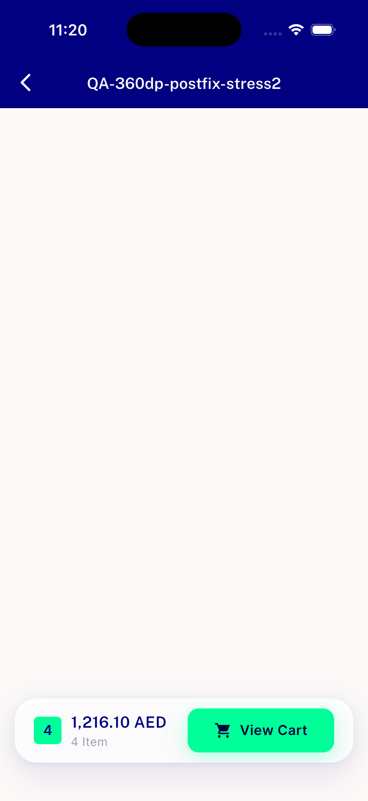
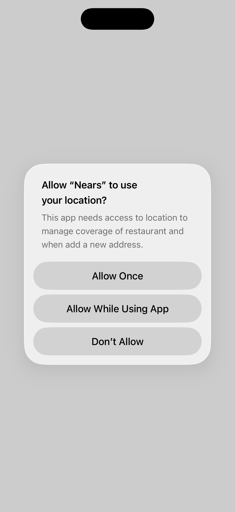
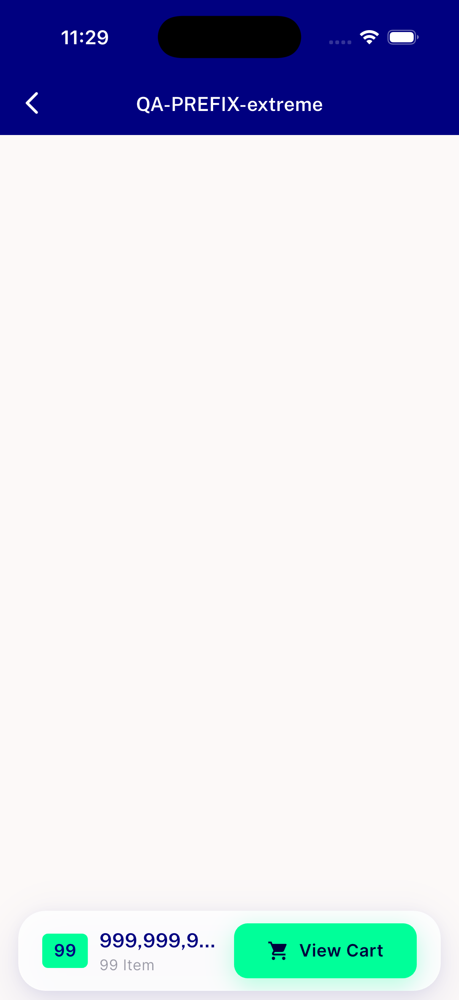
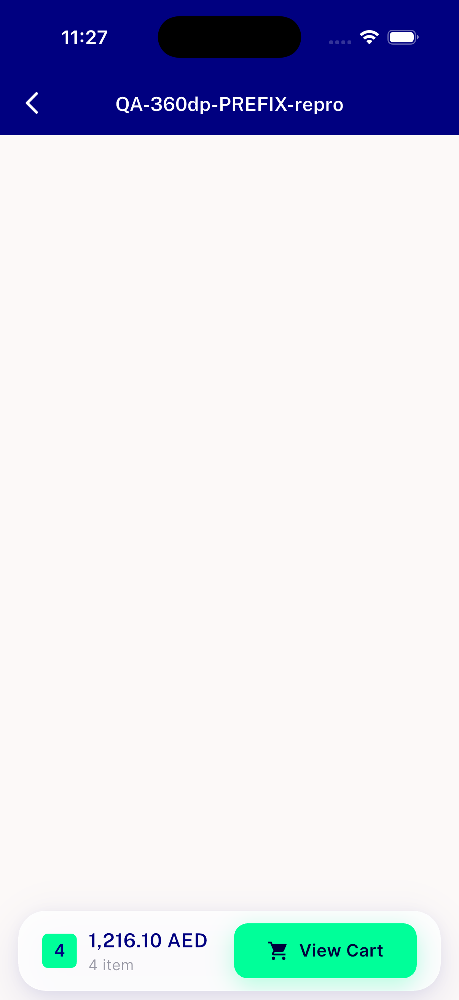
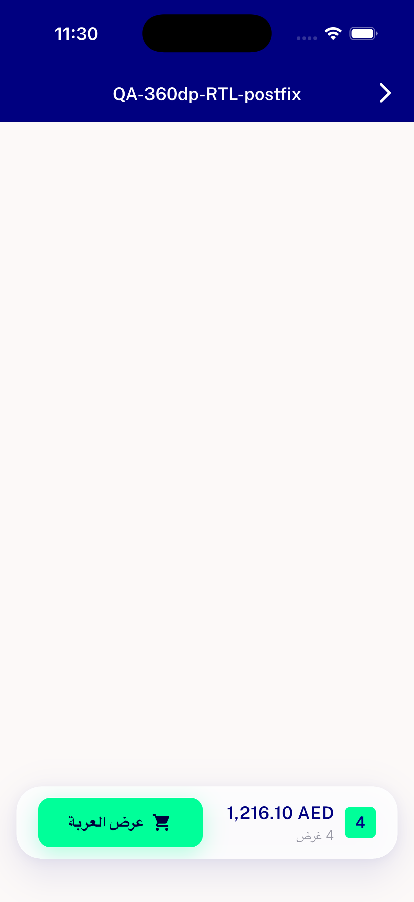

# QA Evidence — NEARS-2534

**PASS — 360dp bottom-cart-bar overflow fix verified live on iOS (Android pool saturated); zero RenderFlex overflow post-fix across real+extreme content, RTL price stays LTR, NButton/badge unclipped**

**6 screenshot(s).** Click any thumbnail for full resolution.

<table>
<tr>
<td align="center" width="33%"> ac1 ac2 postfix 360dp 4items stress</td>
<td align="center" width="33%"> ac1 ac2 postfix 360dp 5items stress</td>
<td align="center" width="33%"> ac1 postfix 360dp 2items</td>
</tr>
<tr>
<td align="center" width="33%"> prefix extreme 360dp</td>
<td align="center" width="33%"> prefix repro 360dp 4items</td>
<td align="center" width="33%"> rtl postfix 360dp</td>
</tr>
</table>

---
*From `nears/docs/qa-evidence/NEARS-2534/` · public-repo scrub policy (no live secrets; verified clean).*
