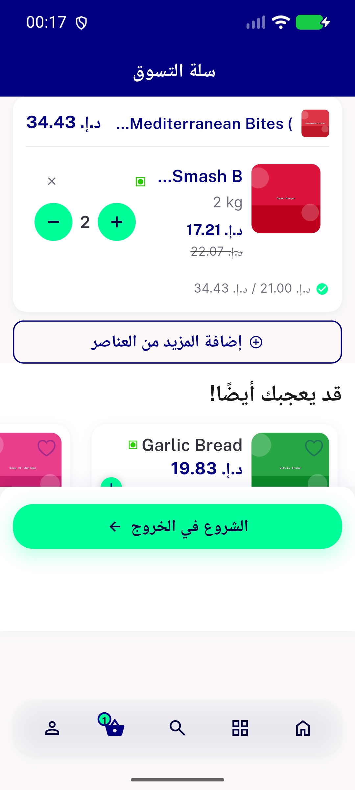
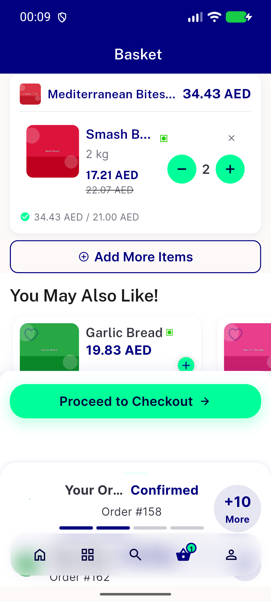
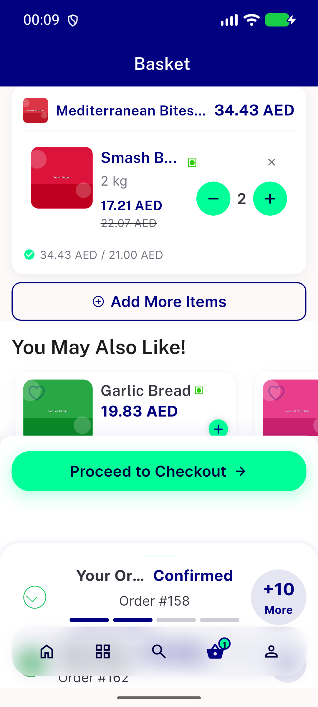
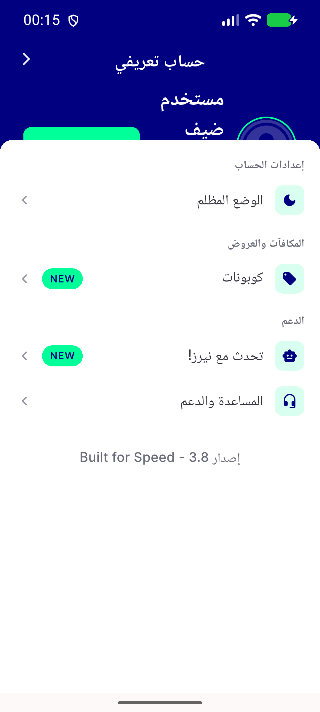
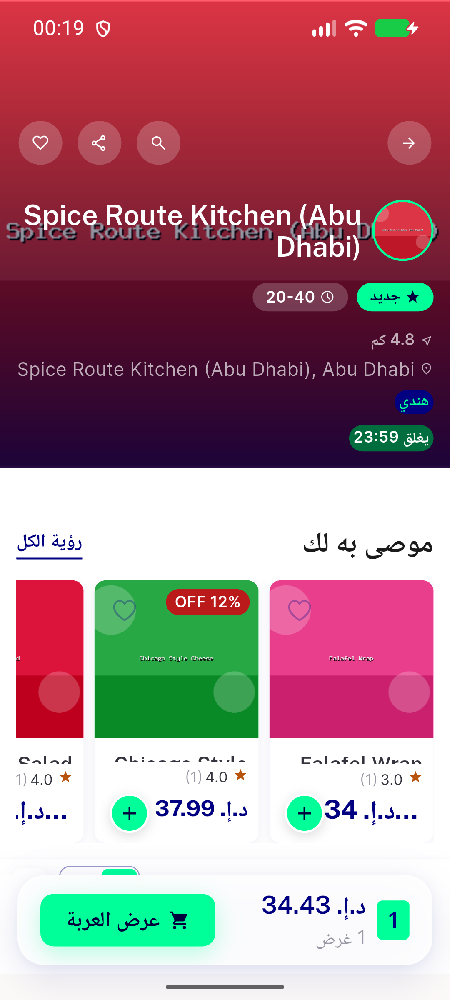
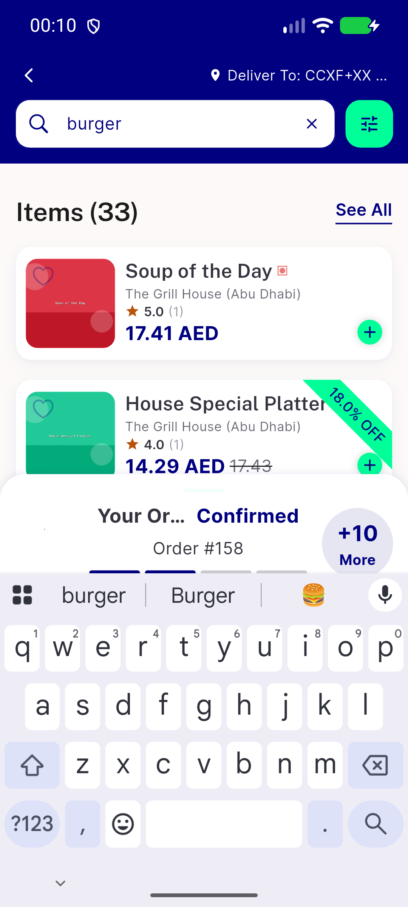

# QA Evidence — NEARS-2535

**PASS - item_widget.dart NEARS-2535 non-grid textscale overflow fix verified live at 1.3x scale (cart suggestion rail primary route + search results regression), 100% scale sanity, RTL/Arabic 1.3x, grid branch regression clean; 47/47 automated tests pass**

**6 screenshot(s).** Click any thumbnail for full resolution.

<table>
<tr>
<td align="center" width="33%"> ac rtl cart suggestion rail 1.3x</td>
<td align="center" width="33%"> ac1 ac2 cart suggestion rail 1.3x scrolled</td>
<td align="center" width="33%"> ac1 ac2 cart suggestion rail 1.3x</td>
</tr>
<tr>
<td align="center" width="33%"> bug profile guest login banner overlap ar 1.3x</td>
<td align="center" width="33%"> regression grid branch store screen 1.3x rtl</td>
<td align="center" width="33%"> regression search results 1.3x</td>
</tr>
</table>

---
*From `nears/docs/qa-evidence/NEARS-2535/` · public-repo scrub policy (no live secrets; verified clean).*
