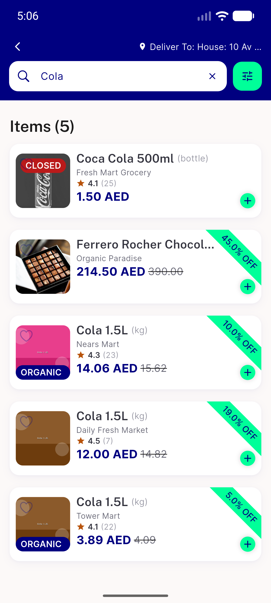
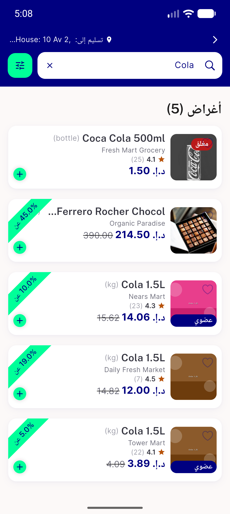

# QA Evidence — NEARS-2539

**PASS — kSearchItemRowHeight 122->130 fix verified live at 1.3x EN+AR/RTL, no RenderFlex overflow, discount/no-discount parity, regression sweep clean**

**4 screenshot(s).** Click any thumbnail for full resolution.

<table>
<tr>
<td align="center" width="33%"> ac1 search list 1.3x en</td>
<td align="center" width="33%"> ac2 search list 1.3x ar rtl</td>
<td align="center" width="33%"> regression cart suggestion rail 1.3x ar</td>
</tr>
<tr>
<td align="center" width="33%"> regression category itemview 1.3x ar</td>
</tr>
</table>

---
*From `nears/docs/qa-evidence/NEARS-2539/` · public-repo scrub policy (no live secrets; verified clean).*
