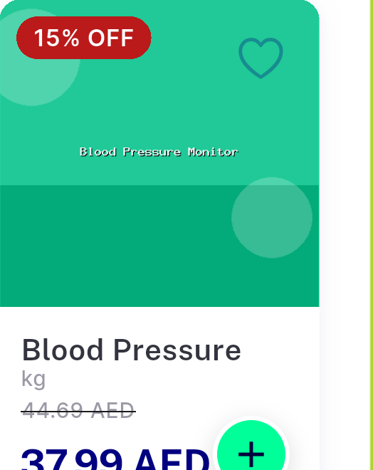
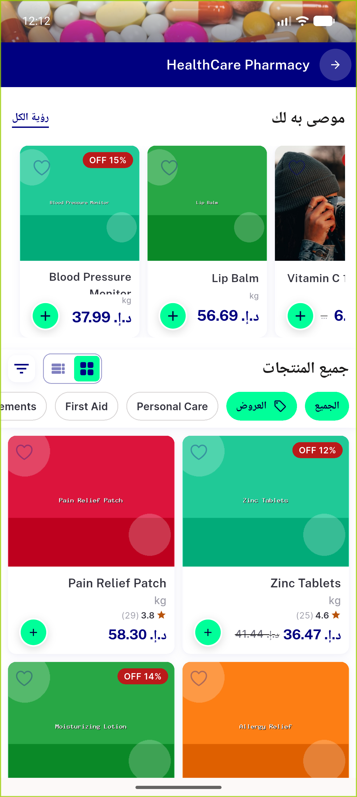
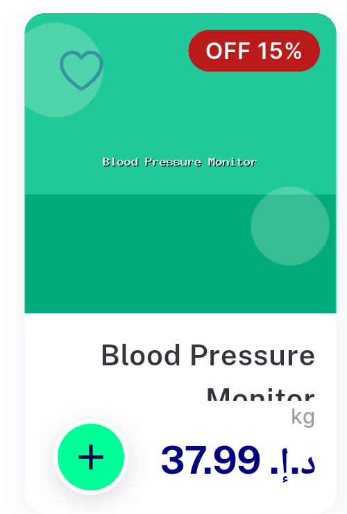
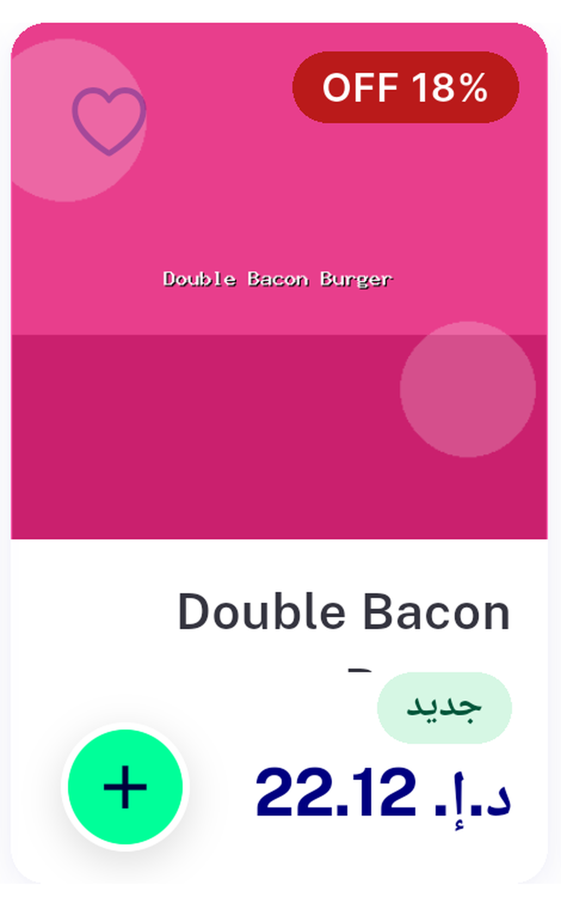
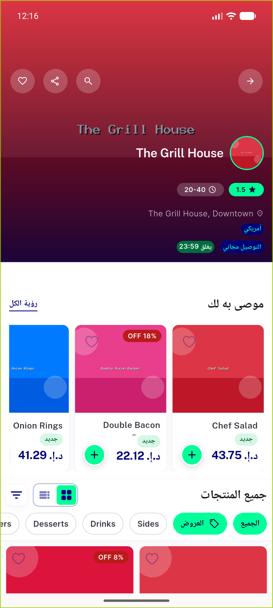
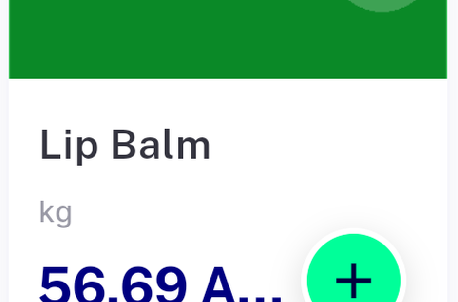
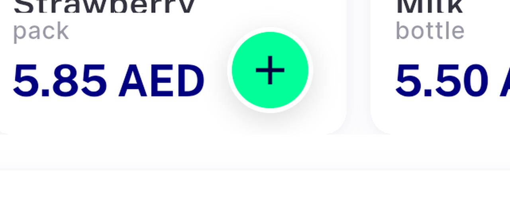

# QA Evidence — NEARS-2542

**FAIL — AC1 stacked strike-through price is invisible under Arabic/RTL on the real 150dp Recommended For You rail (breaks AC1+AC4); AC2/AC3 pass; pre-existing near-zero-width strike regression also found on the unscaled Row branch (unrelated to this diff)**

**9 screenshot(s).** Click any thumbnail for full resolution.

<table>
<tr>
<td align="center" width="33%"> ac1 ac2 stacked price bloodpressure</td>
<td align="center" width="33%"> bug ac4 rtl positive control zinc</td>
<td align="center" width="33%"> bug ac4 rtl strike missing crop</td>
</tr>
<tr>
<td align="center" width="33%"> bug ac4 rtl strike missing full</td>
<td align="center" width="33%"> bug ac4 rtl worstcase doublebacon crop</td>
<td align="center" width="33%"> bug ac4 rtl worstcase doublebacon full</td>
</tr>
<tr>
<td align="center" width="33%"> bug regression nondiscount truncation lipbalm</td>
<td align="center" width="33%"> bug regression strike zerowidth full</td>
<td align="center" width="33%"> bug regression strike zerowidth strawberry</td>
</tr>
</table>

### Other artifacts
- [`bug-ac4-rtl-positive-control-dump.xml`](bug-ac4-rtl-positive-control-dump.xml)
- [`bug-ac4-rtl-strike-missing-dump.xml`](bug-ac4-rtl-strike-missing-dump.xml)
- [`bug-ac4-rtl-worstcase-doublebacon-dump.xml`](bug-ac4-rtl-worstcase-doublebacon-dump.xml)
- [`bug-regression-strike-zerowidth-dump.xml`](bug-regression-strike-zerowidth-dump.xml)

---
*From `nears/docs/qa-evidence/NEARS-2542/` · public-repo scrub policy (no live secrets; verified clean).*
