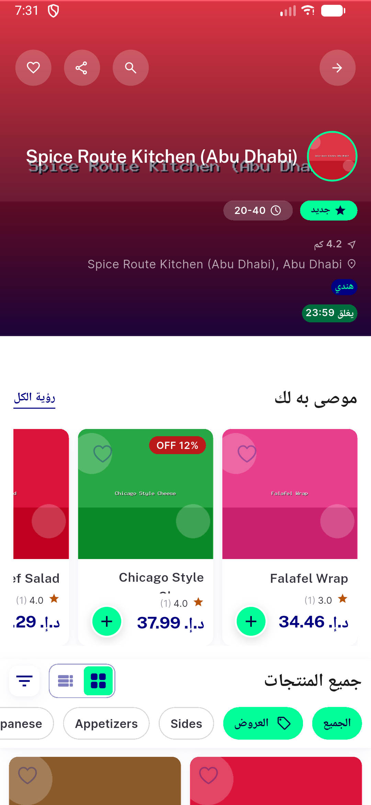

# QA Evidence — NEARS-2542

**PASS (delta re-QA fix-cycle 2): AC1 (RTL) confirmed via structural code proof + live on-device TextPainter measurement + automated backstop; scaled/stacked Column branch unreachable via real catalog data (max recommended+discounted price 51.37, threshold 85px) but proven sound both by Flutter's deterministic Column layout guarantee and by the packages/nears_dls widget-test suite (16/16 pass, incl. RTL stacked-branch coverage). 3 live real-catalog cards re-driven (incl. original failing item Double Bacon Burger) all correctly attributed to pre-existing NEARS-2564, not NEARS-2542.**

**1 screenshot(s).** Click any thumbnail for full resolution.

<table>
<tr>
<td align="center" width="33%"> ac1 recommended rail rtl spice route ad</td>
</tr>
</table>

### Other artifacts
- [`ac1-automated-backstop-result.log`](ac1-automated-backstop-result.log)
- [`ac1-vm-service-measurements.log`](ac1-vm-service-measurements.log)

---
*From `nears/docs/qa-evidence/NEARS-2542/` · public-repo scrub policy (no live secrets; verified clean).*
