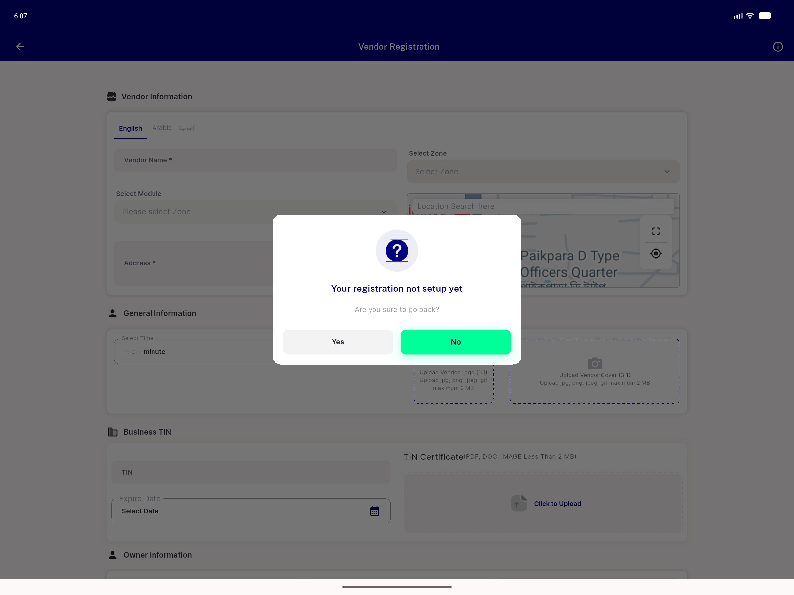
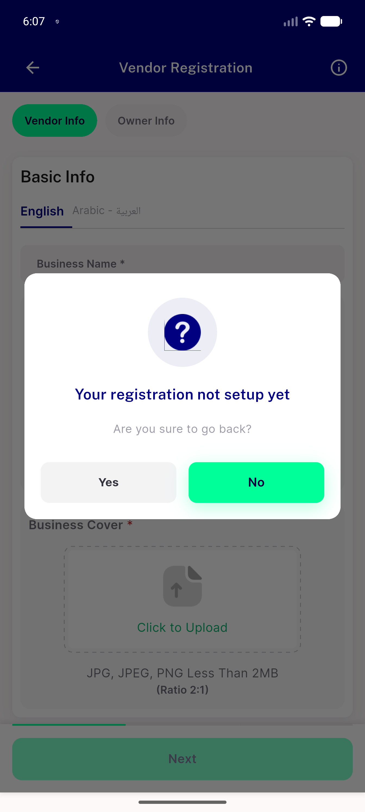
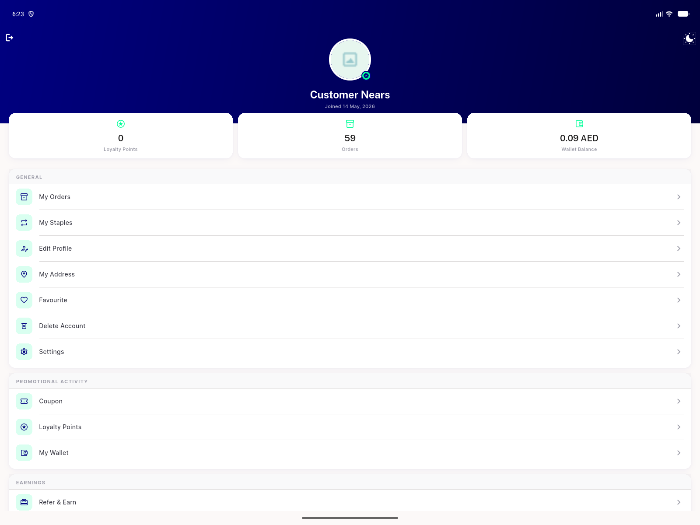

# QA Evidence — NEARS-2546

**PASS: !_debugLocked reproduced via real single-gesture back+Yes on Store Registration desktop-width branch**

**3 screenshot(s).** Click any thumbnail for full resolution.

<table>
<tr>
<td align="center" width="33%"> desktop back dialog</td>
<td align="center" width="33%"> mobile back dialog</td>
<td align="center" width="33%"> post crash landed screen</td>
</tr>
</table>

### Other artifacts
- [`bug-storereg-desktop-back-reentrancy.log`](bug-storereg-desktop-back-reentrancy.log)
- [`repro-attempt-log.md`](repro-attempt-log.md)

---
*From `nears/docs/qa-evidence/NEARS-2546/` · public-repo scrub policy (no live secrets; verified clean).*
