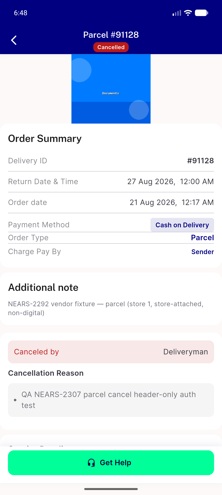
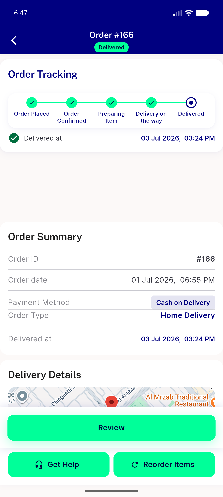
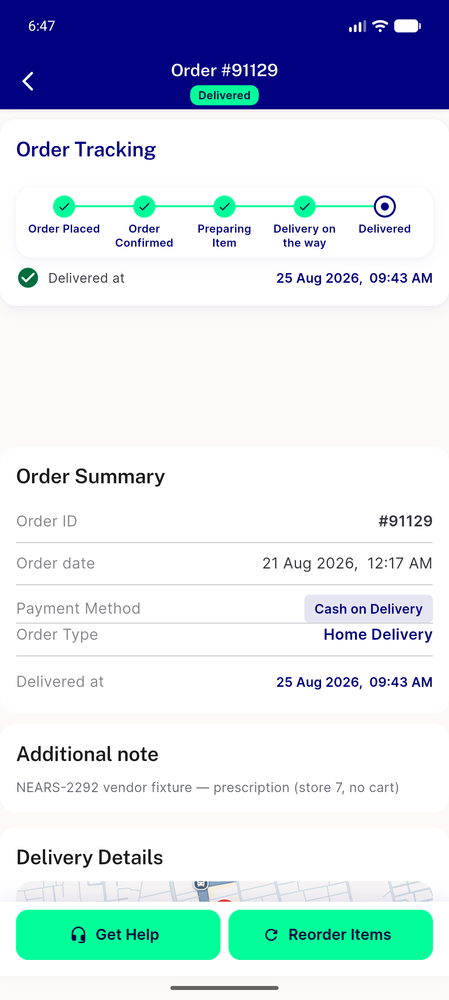

# QA Evidence — NEARS-2549

**PASS — corrected AC re-verified live on OrderDetailsScreen (order-id/delivery-id row now unconditional, mobile-visible, no regression to desktop or id-per-order binding)**

**3 screenshot(s).** Click any thumbnail for full resolution.

<table>
<tr>
<td align="center" width="33%"> orderdetails mobile deliveryid 91128</td>
<td align="center" width="33%"> orderdetails mobile orderid 166</td>
<td align="center" width="33%"> orderdetails mobile orderid 91129</td>
</tr>
</table>

---
*From `nears/docs/qa-evidence/NEARS-2549/` · public-repo scrub policy (no live secrets; verified clean).*
