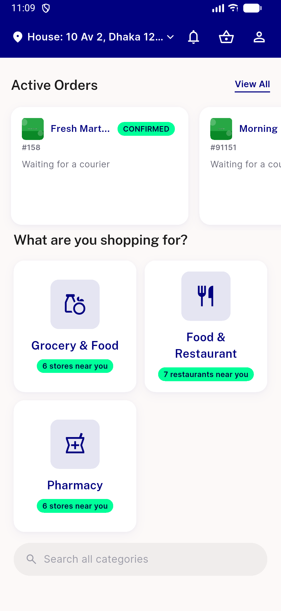

# QA Evidence — NEARS-2552

**PASS -- cm-firebase-token module-check bypass fix (AC1/AC2 live-confirmed on Android emulator-5562 + direct API/DB evidence; AC3 push-delivery leg unverifiable in this sandbox, infra-limited not a code defect; regression sweep clean)**

**1 screenshot(s).** Click any thumbnail for full resolution.

<table>
<tr>
<td align="center" width="33%"> ac2 post login home clean</td>
</tr>
</table>

### Other artifacts
- [`ac1-live-login-flow.log`](ac1-live-login-flow.log)
- [`ac3-push-spotcheck-and-env-note.log`](ac3-push-spotcheck-and-env-note.log)
- [`api-repro-and-regression.log`](api-repro-and-regression.log)

---
*From `nears/docs/qa-evidence/NEARS-2552/` · public-repo scrub policy (no live secrets; verified clean).*
