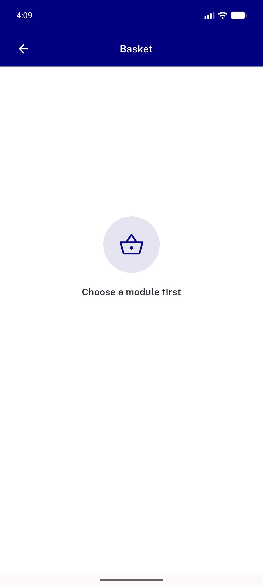
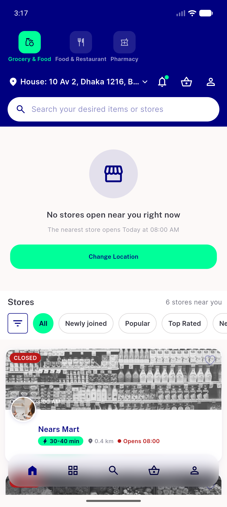

# QA Evidence — NEARS-2553

**PASS - guestLogin/clearSharedData cacheModule identity refresh verified live**

**2 screenshot(s).** Click any thumbnail for full resolution.

<table>
<tr>
<td align="center" width="33%"> ac1 guest cart choose module first</td>
<td align="center" width="33%"> ac1 guest module store list</td>
</tr>
</table>

---
*From `nears/docs/qa-evidence/NEARS-2553/` · public-repo scrub policy (no live secrets; verified clean).*
