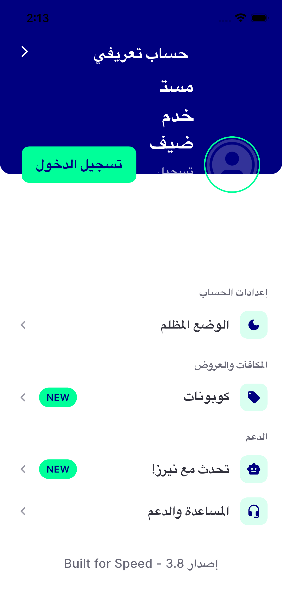
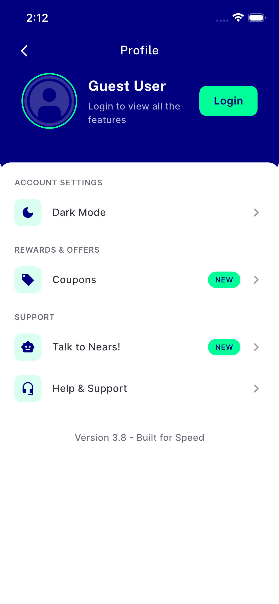
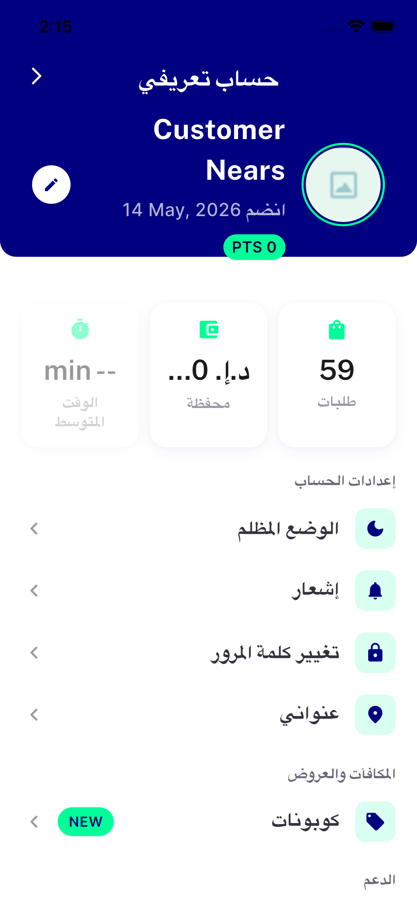

# QA Evidence — NEARS-2558

**QA RETRY (attempt 2) PASS — AC4 fix-cycle-2 formula confirmed exact on iOS sim (padTop+180), AC1-3 re-confirmed AR-RTL@1.3x**

**3 screenshot(s).** Click any thumbnail for full resolution.

<table>
<tr>
<td align="center" width="33%"> retry ac1 3 ar rtl 1.3x guest profile ios</td>
<td align="center" width="33%"> retry ac4 ltr 1.0x guest profile ios</td>
<td align="center" width="33%"> retry bonus loggedin ar rtl 1.3x ios</td>
</tr>
</table>

---
*From `nears/docs/qa-evidence/NEARS-2558/` · public-repo scrub policy (no live secrets; verified clean).*
