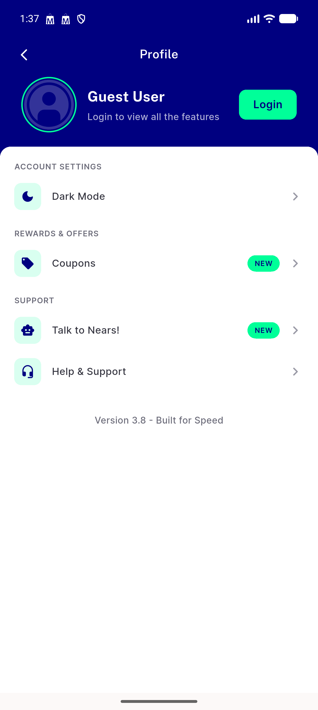
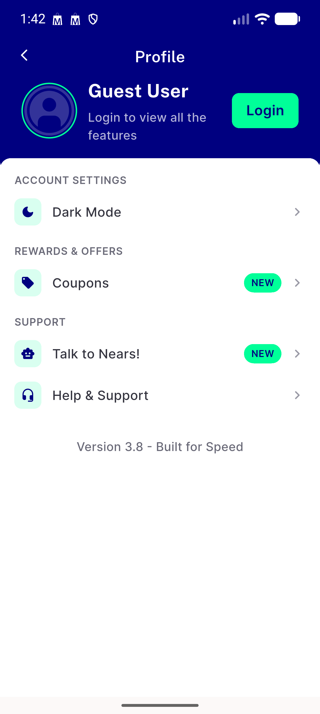

# QA Evidence — NEARS-2558

**QA NEARS-2558: FAIL — AC4 LTR/1.0x settings-card position regression on tall-status-bar device; AC1/AC2/AC3 pass**

**5 screenshot(s).** Click any thumbnail for full resolution.

<table>
<tr>
<td align="center" width="33%"> ac bonus ar rtl 1.0x</td>
<td align="center" width="33%"> ac1 ac3 ar rtl 1.3x guest profile</td>
<td align="center" width="33%"> ac4 ltr 1.0x guest profile</td>
</tr>
<tr>
<td align="center" width="33%"> bonus loggedin ar rtl 1.3x loyalty badge</td>
<td align="center" width="33%"> bonus ltr 1.3x guest profile</td>
</tr>
</table>

### Other artifacts
- [`bug-ac4-ltr-1.0x-position-shift.log`](bug-ac4-ltr-1.0x-position-shift.log)

---
*From `nears/docs/qa-evidence/NEARS-2558/` · public-repo scrub policy (no live secrets; verified clean).*
