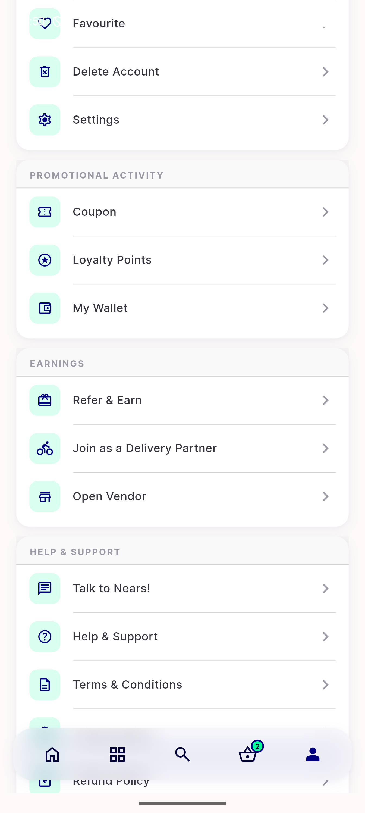

# QA Evidence — NEARS-2559

**PASS — cycle 1 delta re-QA: Earnings group + Loyalty Points render correctly for fresh-boot (local-cache MISS) and cache-hit relaunch, retry unit tests 3/3 green, no regressions**

**3 screenshot(s).** Click any thumbnail for full resolution.

<table>
<tr>
<td align="center" width="33%"> menu screen earnings absent first view</td>
<td align="center" width="33%"> menu screen earnings absent</td>
<td align="center" width="33%"> menu screen earnings present cycle1</td>
</tr>
</table>

### Other artifacts
- [`menu-screen-earnings-absent-dump.xml`](menu-screen-earnings-absent-dump.xml)
- [`menu-screen-earnings-present-cycle1-dump.xml`](menu-screen-earnings-present-cycle1-dump.xml)

---
*From `nears/docs/qa-evidence/NEARS-2559/` · public-repo scrub policy (no live secrets; verified clean).*
