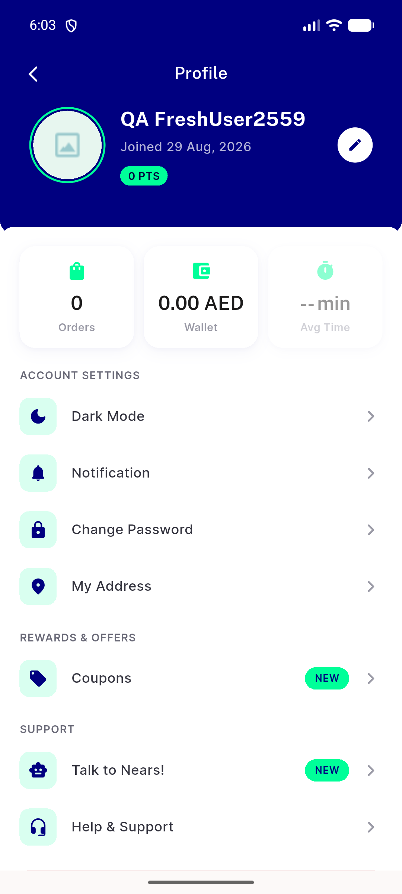
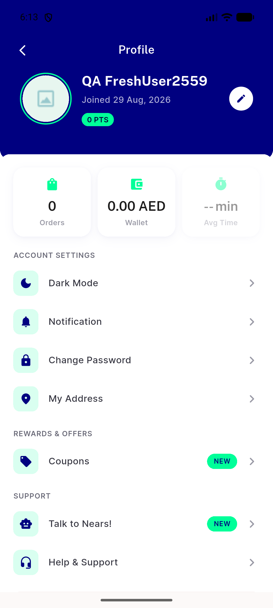

# QA Evidence — NEARS-2559

**FAIL — Earnings group (Refer & Earn / Join as a Delivery Man / Open Vendor) renders nothing on fresh account despite server-confirmed toggles ON; systemic config-gating defect (loyalty points also affected), not a local-cache artifact (survives forced hot-reload reassemble)**

**2 screenshot(s).** Click any thumbnail for full resolution.

<table>
<tr>
<td align="center" width="33%"> menu screen earnings absent first view</td>
<td align="center" width="33%"> menu screen earnings absent</td>
</tr>
</table>

### Other artifacts
- [`menu-screen-earnings-absent-dump.xml`](menu-screen-earnings-absent-dump.xml)

---
*From `nears/docs/qa-evidence/NEARS-2559/` · public-repo scrub policy (no live secrets; verified clean).*
