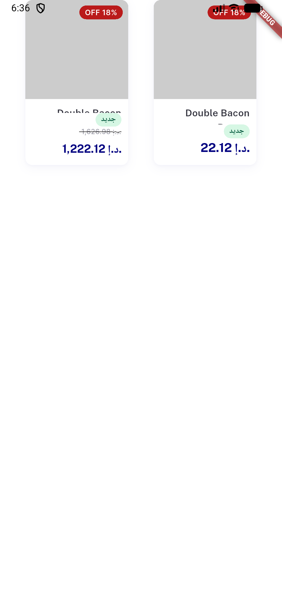

# QA Evidence — NEARS-2563

**cycle-3 live-device geometry repro: CARD1(real QA values, 22.12/26.98) shows the strike clamped to 0<=w<=2.0px matching _discountPriceRowFlex's leftover-flex formula exactly (unscaled Row branch, pre-existing/untouched); CARD2(long price, forces scaled=true) shows the NEARS-2542 stacked Column branch rendering both prices correctly, same device/fonts/RTL**

**1 screenshot(s).** Click any thumbnail for full resolution.

<table>
<tr>
<td align="center" width="33%"> fix cycle3 live device geometry repro</td>
</tr>
</table>

---
*From `nears/docs/qa-evidence/NEARS-2563/` · public-repo scrub policy (no live secrets; verified clean).*
