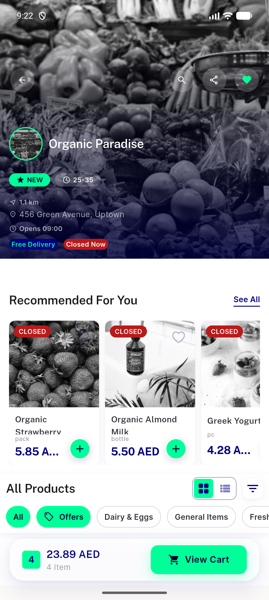
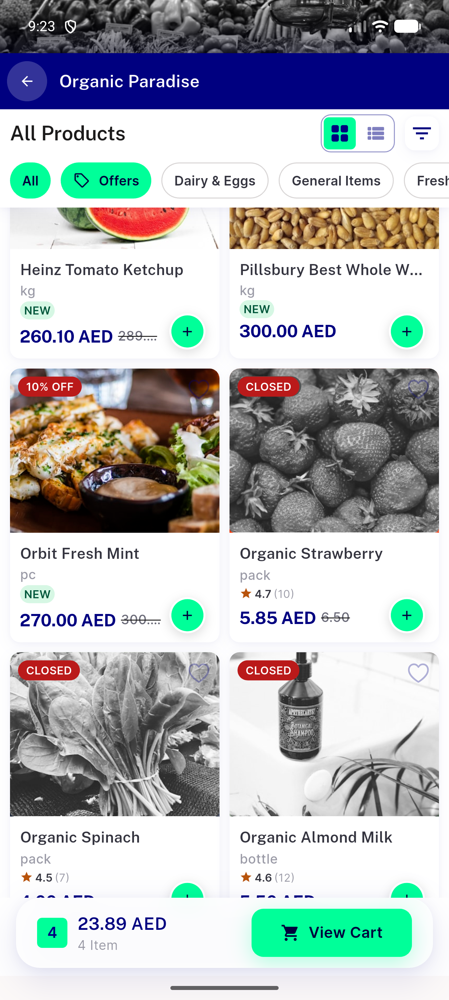
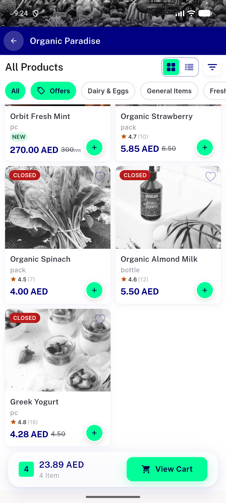
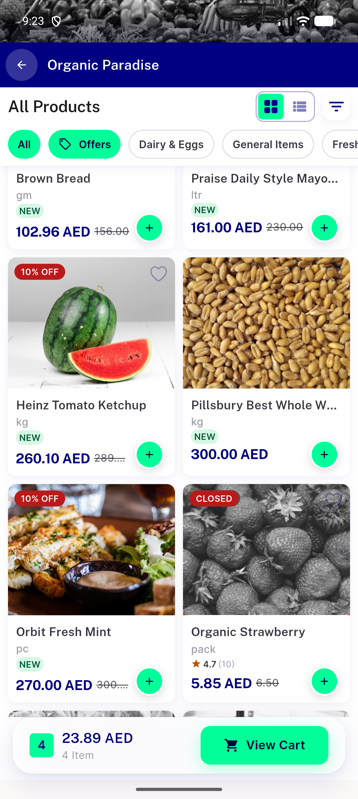
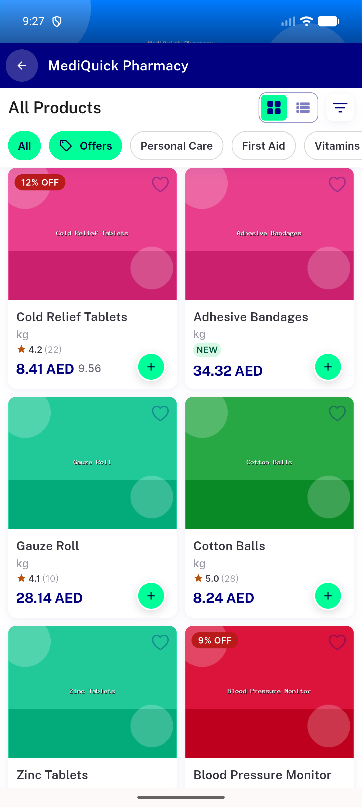

# QA Evidence — NEARS-2564

**PASS -- strike-through fix-cycle 1 verified live on emulator-5554, AC1-4 confirmed, DLS suite green (2 pre-existing catalog.yaml regressions unrelated to this ticket)**

**6 screenshot(s).** Click any thumbnail for full resolution.

<table>
<tr>
<td align="center" width="33%"> ac1 3 organic paradise rail</td>
<td align="center" width="33%"> ac1 nitemcard grid organic strawberry</td>
<td align="center" width="33%"> ac2 check greek yogurt location</td>
</tr>
<tr>
<td align="center" width="33%"> ac2 nitemcard greek yogurt grid</td>
<td align="center" width="33%"> ac2 nitemcard greek yogurt</td>
<td align="center" width="33%"> ac3 nitemcard cold relief tablets</td>
</tr>
</table>

---
*From `nears/docs/qa-evidence/NEARS-2564/` · public-repo scrub policy (no live secrets; verified clean).*
