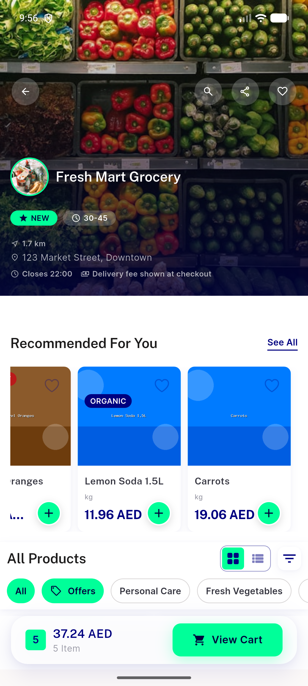
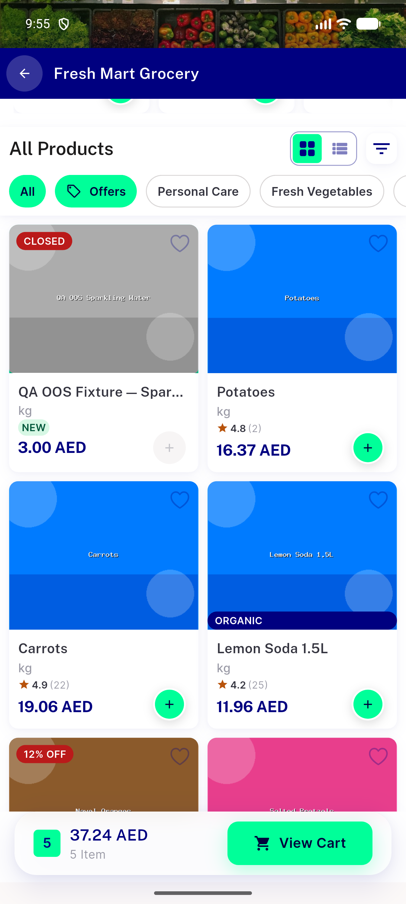
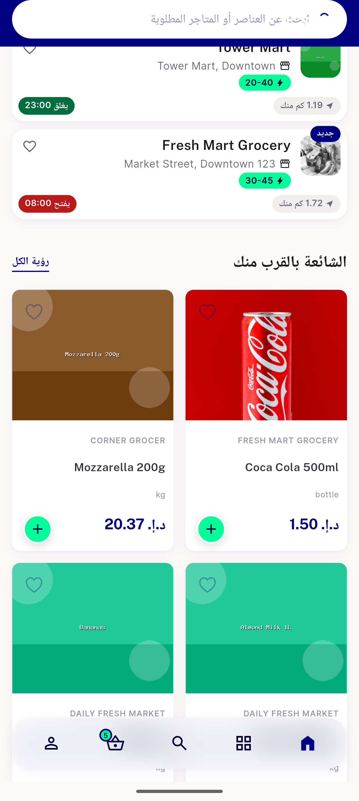

# QA Evidence — NEARS-2565

**PASS - NEARS-2565 non-discounted price scale-to-fit confirmed live on 150dp rail, LTR+RTL, no truncation, logs clean**

**9 screenshot(s).** Click any thumbnail for full resolution.

<table>
<tr>
<td align="center" width="33%"> ac1 rail swipe1</td>
<td align="center" width="33%"> ac1 rail swipe2</td>
<td align="center" width="33%"> ac1 rail swipe3</td>
</tr>
<tr>
<td align="center" width="33%"> ac1 recommended rail ltr</td>
<td align="center" width="33%"> ac1 rtl rail swipe</td>
<td align="center" width="33%"> ac1 rtl rail swipe2</td>
</tr>
<tr>
<td align="center" width="33%"> ac1 rtl rail</td>
<td align="center" width="33%"> ac1 scroll up 1</td>
<td align="center" width="33%"> regression trending nearby rtl</td>
</tr>
</table>

---
*From `nears/docs/qa-evidence/NEARS-2565/` · public-repo scrub policy (no live secrets; verified clean).*
