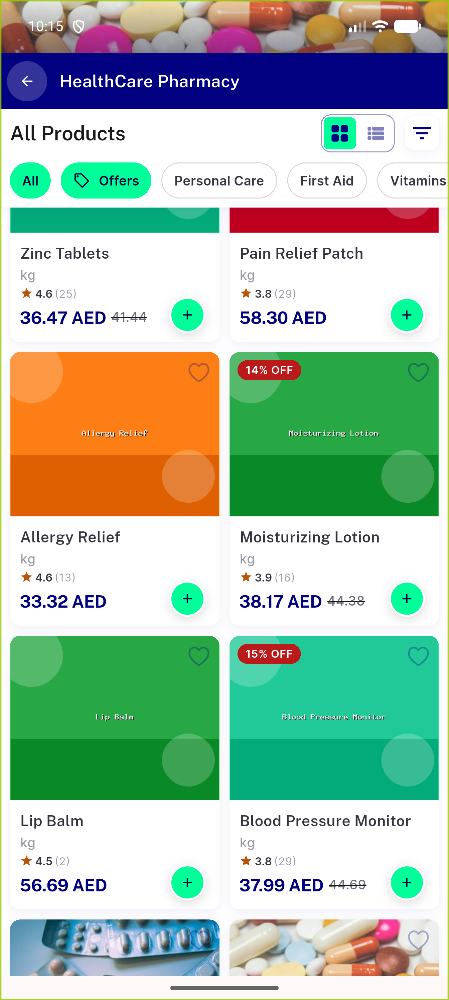
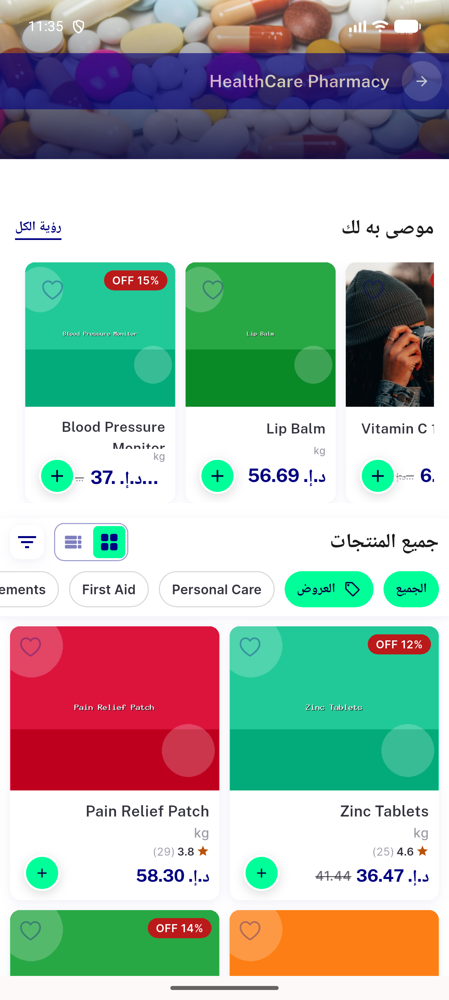
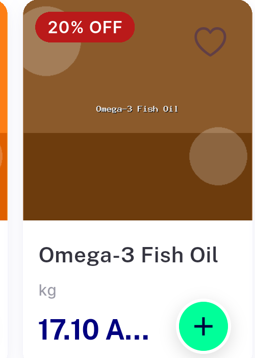
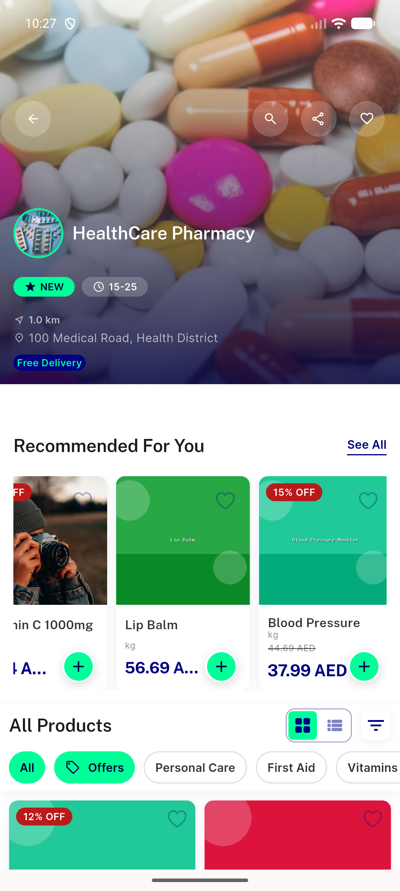
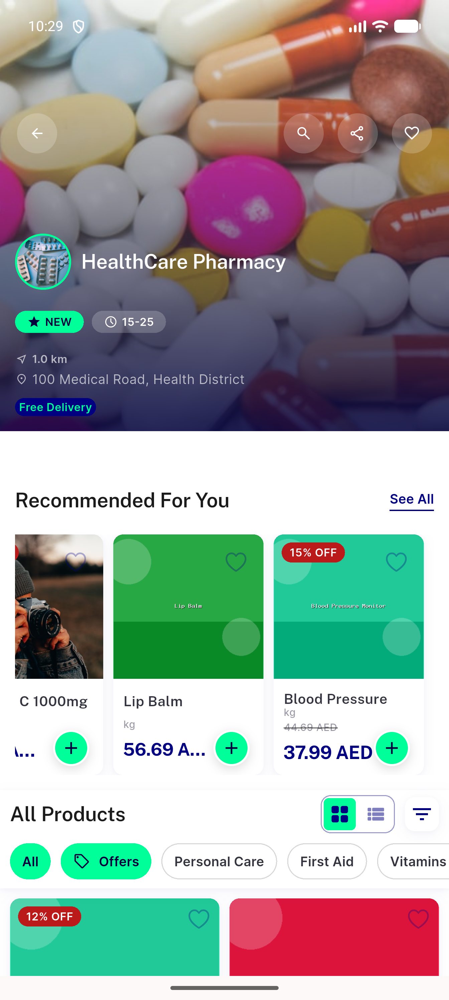
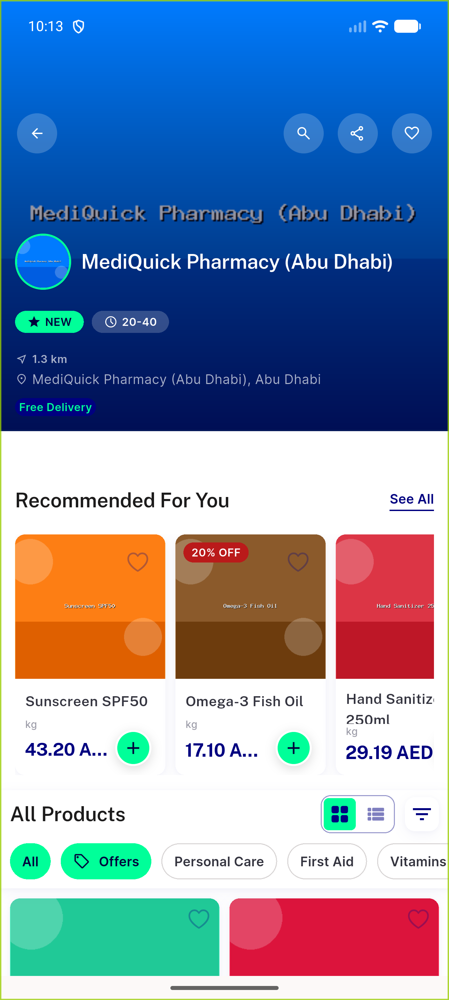
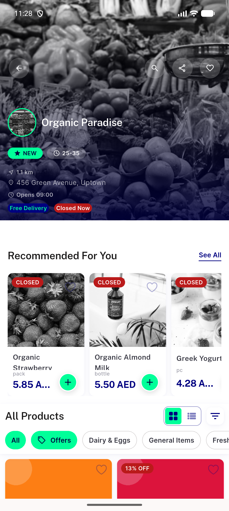
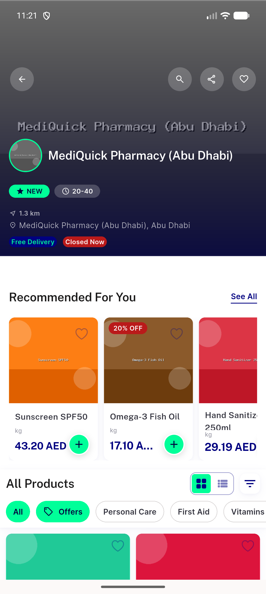

# QA Evidence — NEARS-2565

**PASS - fix-cycle 2 (98c7daf385) re-QA: Lip Balm + Sunscreen SPF50 confirmed clearing the true 150dp rail live in en/LTR (+ Lip Balm also ar/RTL); Organic Strawberry/Greek Yogurt are a data-gap (only exist as discounted items, out-of-scope branch, confirmed regression logged separately)**

**30 screenshot(s).** Click any thumbnail for full resolution.

<table>
<tr>
<td align="center" width="33%"> ac1 lipbalm 150dp rail no truncation</td>
<td align="center" width="33%"> ac1 lipbalm fullprice healthcarepharmacy</td>
<td align="center" width="33%"> ac1 rail swipe1</td>
</tr>
<tr>
<td align="center" width="33%"> ac1 rail swipe2</td>
<td align="center" width="33%"> ac1 rail swipe3</td>
<td align="center" width="33%"> ac1 recommended rail ltr</td>
</tr>
<tr>
<td align="center" width="33%"> ac1 rtl rail swipe</td>
<td align="center" width="33%"> ac1 rtl rail swipe2</td>
<td align="center" width="33%"> ac1 rtl rail</td>
</tr>
<tr>
<td align="center" width="33%"> ac1 scroll up 1</td>
<td align="center" width="33%"> ac2 organicstrawberry discount recommendedrail</td>
<td align="center" width="33%"> ac3 regression 230dp grid fine</td>
</tr>
<tr>
<td align="center" width="33%"> ar lipbalm recommended rail narrow</td>
<td align="center" width="33%"> ar lipbalm recommended rail</td>
<td align="center" width="33%"> bug crossmodule grocery rail truncation</td>
</tr>
<tr>
<td align="center" width="33%"> bug discount strike price missing</td>
<td align="center" width="33%"> bug discounted rail price possible truncation</td>
<td align="center" width="33%"> bug lipbalm english aed truncates 150dp rail</td>
</tr>
<tr>
<td align="center" width="33%"> bug lipbalm still truncates on true 150dp recommended rail</td>
<td align="center" width="33%"> bug lipbalm truncates rail confirm2</td>
<td align="center" width="33%"> bug nondiscount price still truncates 150dp rail</td>
</tr>
<tr>
<td align="center" width="33%"> bug nondiscount price truncation zoom</td>
<td align="center" width="33%"> en lipbalm recommended rail</td>
<td align="center" width="33%"> en organic greek recommended rail</td>
</tr>
<tr>
<td align="center" width="33%"> en sunscreen recommended rail</td>
<td align="center" width="33%"> regression check openstore discount rail</td>
<td align="center" width="33%"> regression check2 fullyvisible discount card</td>
</tr>
<tr>
<td align="center" width="33%"> regression english discounted coldflu truncates</td>
<td align="center" width="33%"> regression recommended rail overview</td>
<td align="center" width="33%"> regression trending nearby rtl</td>
</tr>
</table>

### Other artifacts
- [`ar-lipbalm-a11y-dump.xml`](ar-lipbalm-a11y-dump.xml)
- [`en-organic-greek-a11y-dump.xml`](en-organic-greek-a11y-dump.xml)
- [`progress.md`](progress.md)

---
*From `nears/docs/qa-evidence/NEARS-2565/` · public-repo scrub policy (no live secrets; verified clean).*
