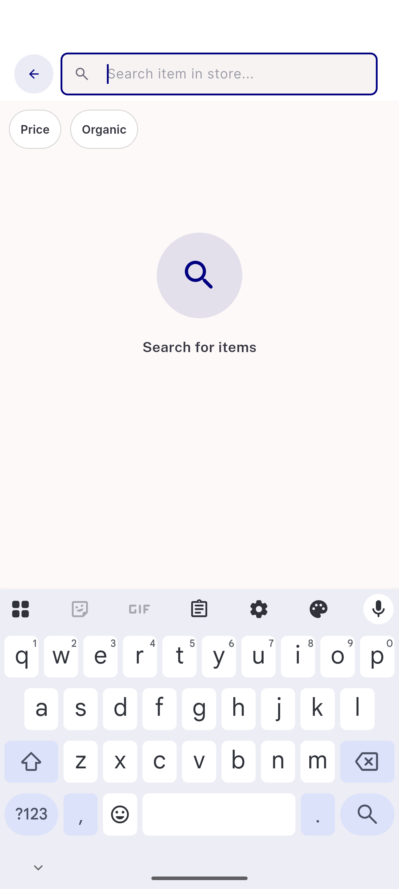
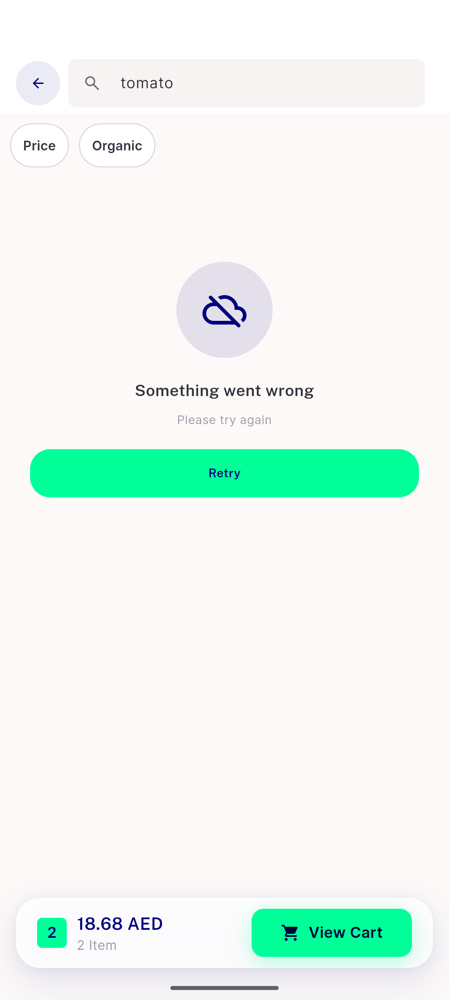
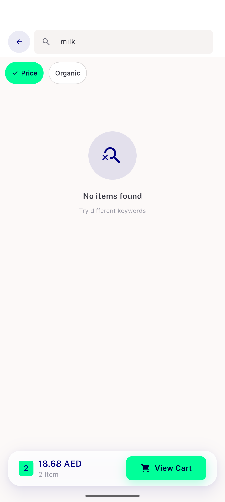
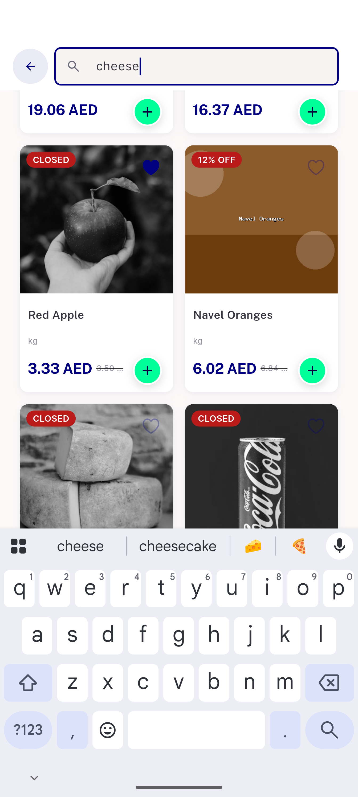

# QA Evidence — NEARS-2567

**PASS — F7 Flow 4 in-store search states, all ACs demonstrated live on emulator-5566**

**4 screenshot(s).** Click any thumbnail for full resolution.

<table>
<tr>
<td align="center" width="33%"> ac1 ac6 idle searchbar</td>
<td align="center" width="33%"> ac5 error retry</td>
<td align="center" width="33%"> ac7 zero results</td>
</tr>
<tr>
<td align="center" width="33%"> ac8 shimmer attempt</td>
</tr>
</table>

---
*From `nears/docs/qa-evidence/NEARS-2567/` · public-repo scrub policy (no live secrets; verified clean).*
