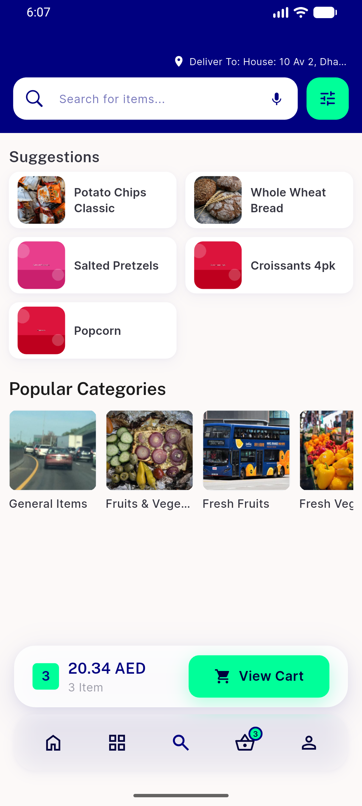
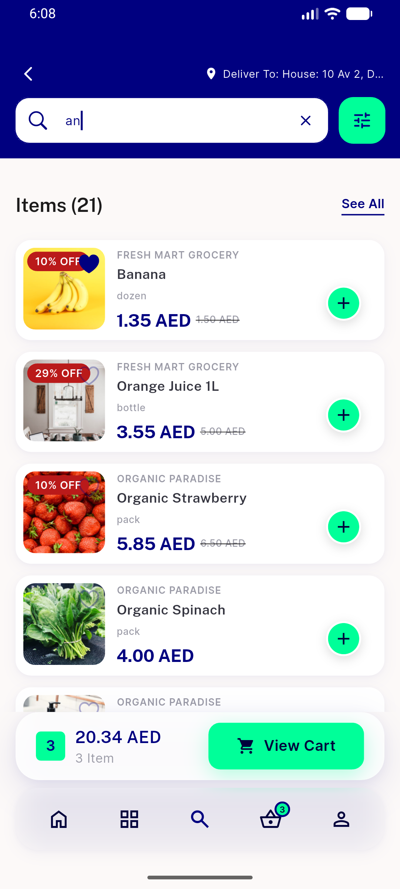
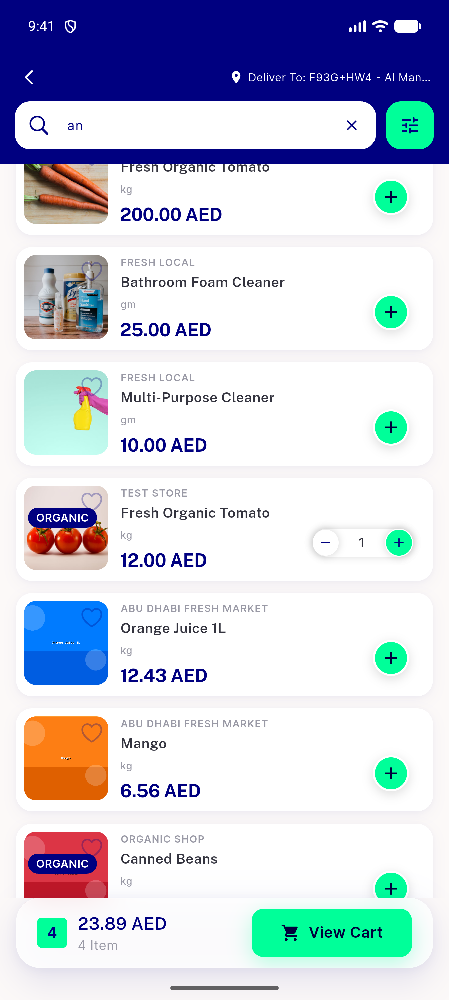
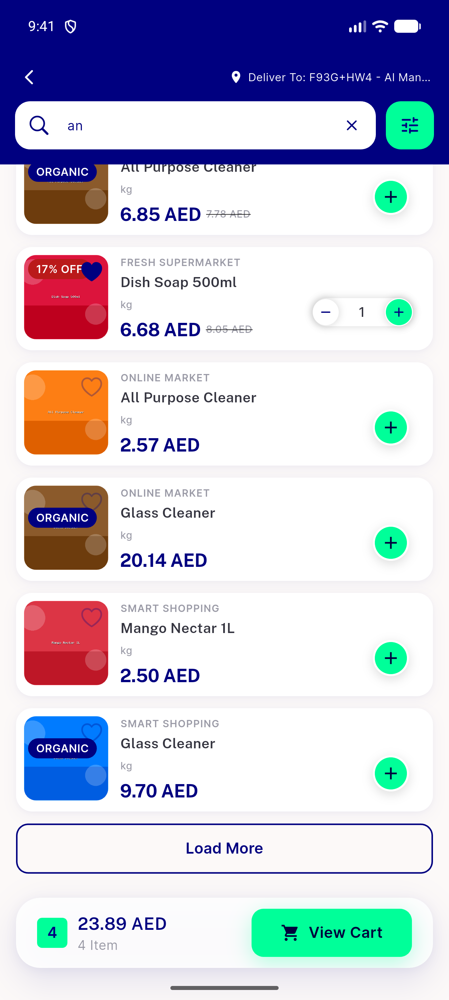
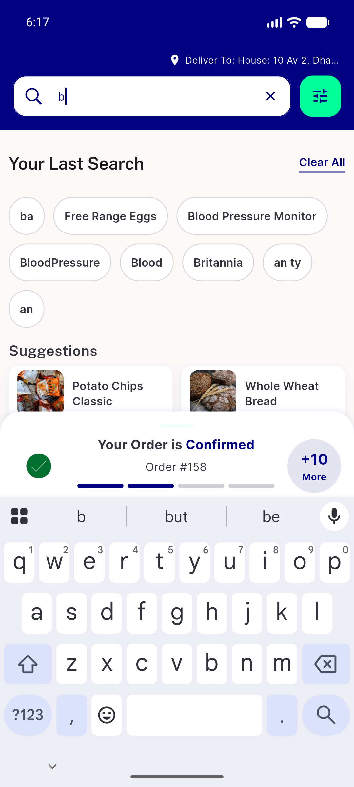
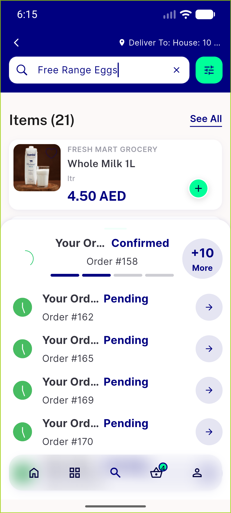
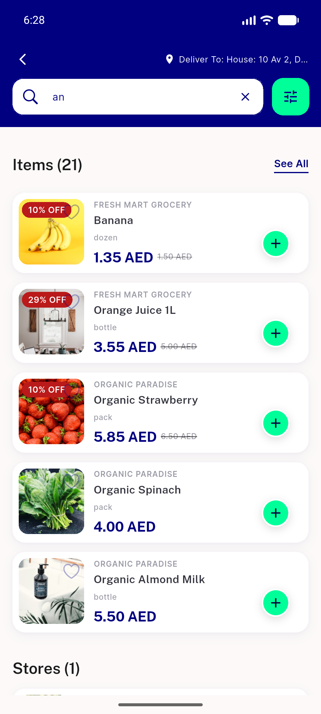
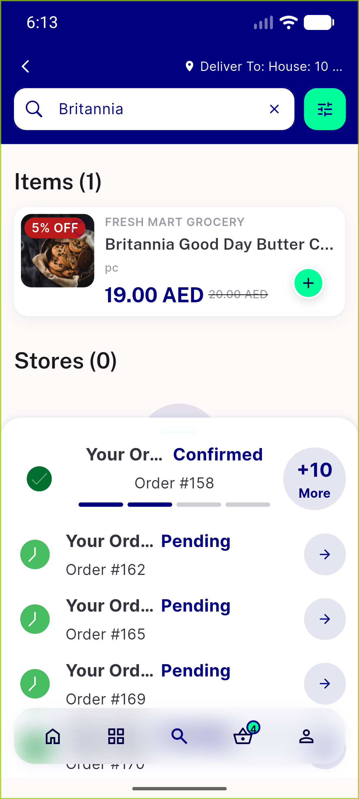
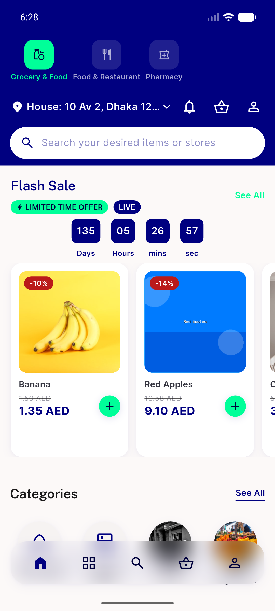

# QA Evidence — NEARS-2568

**PASS delta fix-cycle-1: AC2 re-demonstrated live (load-more boundary), 149/149 automated tests green**

**11 screenshot(s).** Click any thumbnail for full resolution.

<table>
<tr>
<td align="center" width="33%"> ac1 idle state</td>
<td align="center" width="33%"> ac2 item rows addcontrol</td>
<td align="center" width="33%"> ac2 loadmore boundary fixcycle1</td>
</tr>
<tr>
<td align="center" width="33%"> ac2 loadmore page2 fixcycle1</td>
<td align="center" width="33%"> ac4 loading skeleton idle mixed</td>
<td align="center" width="33%"> ac5 recent chip rerun</td>
</tr>
<tr>
<td align="center" width="33%"> ac7 filter sheet context</td>
<td align="center" width="33%"> ac7 pushed route mount</td>
<td align="center" width="33%"> scope2 1p3x overflow longname discount</td>
</tr>
<tr>
<td align="center" width="33%"> scope5 rtl mirror</td>
<td align="center" width="33%"> scope7 grid itemcard regression</td>
</tr>
</table>

### Other artifacts
- [`bug-search-load-more-itemcontroller.log`](bug-search-load-more-itemcontroller.log)

---
*From `nears/docs/qa-evidence/NEARS-2568/` · public-repo scrub policy (no live secrets; verified clean).*
