# QA Evidence — NEARS-2569

**PASS — global search item rows on NItemCard(row); idle/results/typeahead/empty-states/RTL/large-text/no-filter all verified live on emulator-5558**

**11 screenshot(s).** Click any thumbnail for full resolution.

<table>
<tr>
<td align="center" width="33%"><a href="ac-typeahead-divider.png">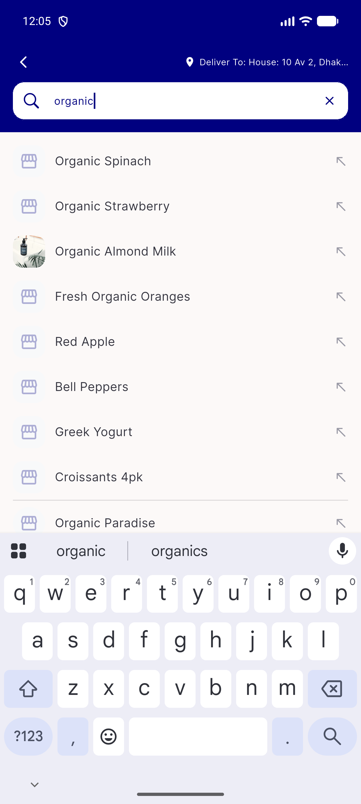</a> ac typeahead divider</td>
<td align="center" width="33%"><a href="ac1-idle-state.png">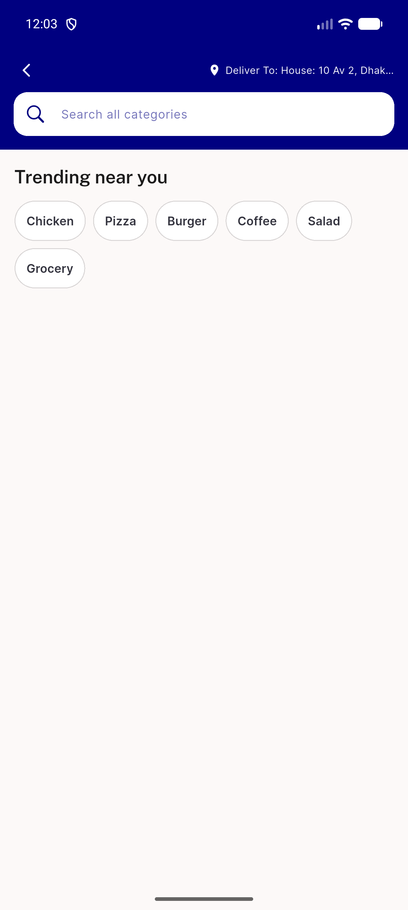</a> ac1 idle state</td>
<td align="center" width="33%"><a href="ac1-idle-with-recent.png">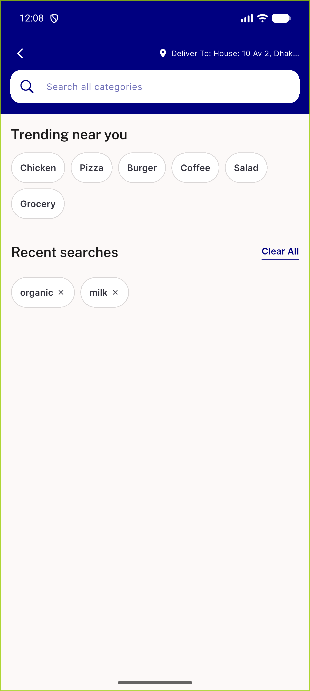</a> ac1 idle with recent</td>
</tr>
<tr>
<td align="center" width="33%"><a href="ac2-results-itemcard-row.png">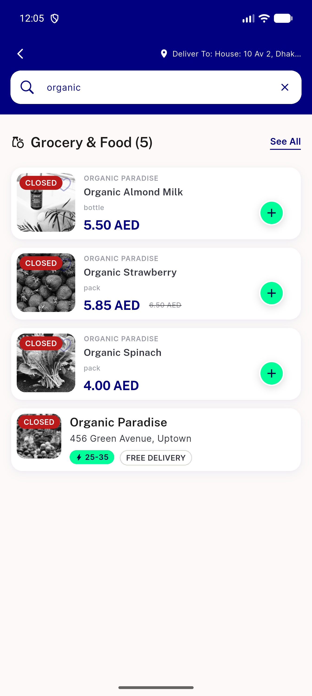</a> ac2 results itemcard row</td>
<td align="center" width="33%"><a href="ac3-nodatafound.png">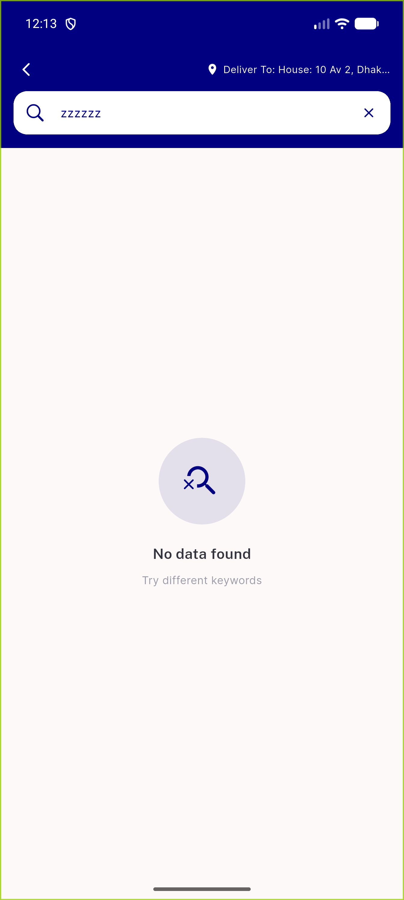</a> ac3 nodatafound</td>
<td align="center" width="33%"><a href="ac3-nosuggestions.png">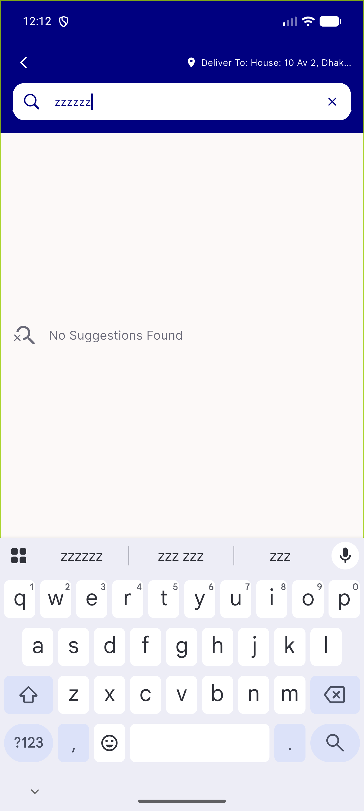</a> ac3 nosuggestions</td>
</tr>
<tr>
<td align="center" width="33%"><a href="ac4-trending-chip-results.png">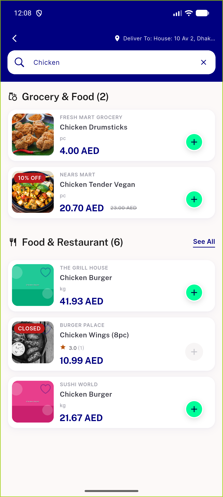</a> ac4 trending chip results</td>
<td align="center" width="33%"><a href="reg-largetext-130-idle.png">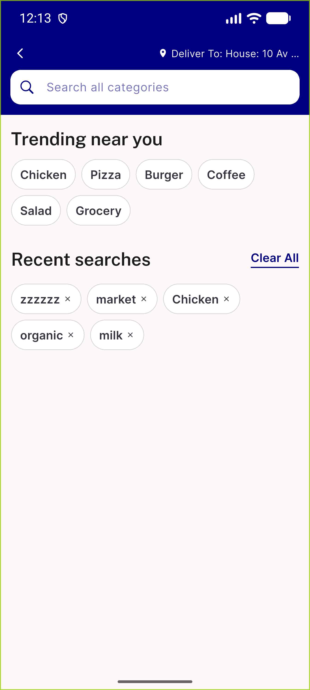</a> reg largetext 130 idle</td>
<td align="center" width="33%"><a href="reg-largetext-130-results.png">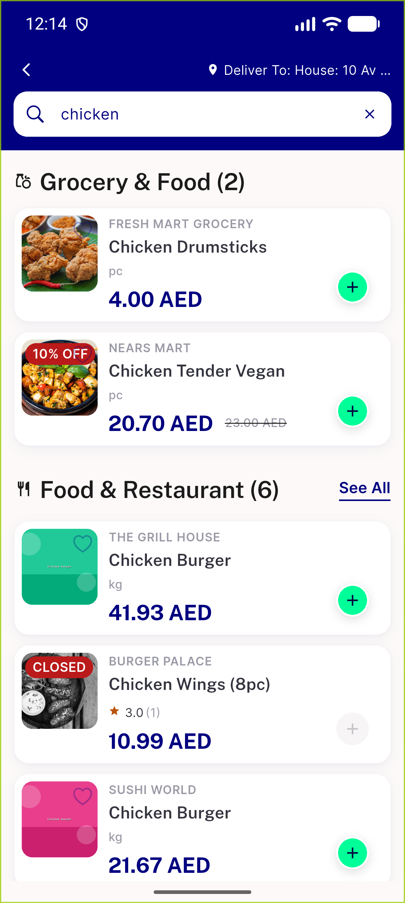</a> reg largetext 130 results</td>
</tr>
<tr>
<td align="center" width="33%"><a href="rtl-idle.png">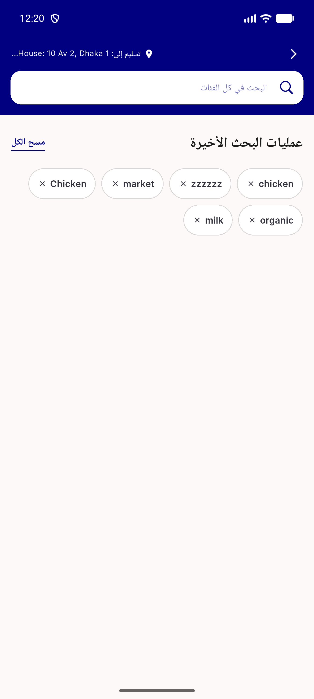</a> rtl idle</td>
<td align="center" width="33%"><a href="rtl-results.png">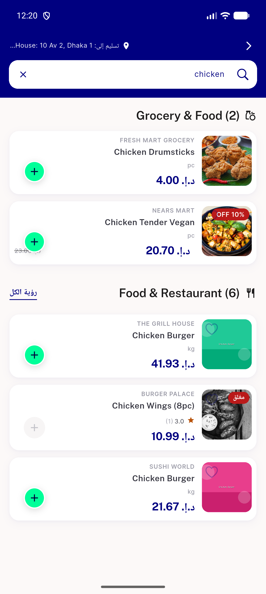</a> rtl results</td>
</tr>
</table>

---
*From `nears/docs/qa-evidence/NEARS-2569/` · public-repo scrub policy (no live secrets; verified clean).*
