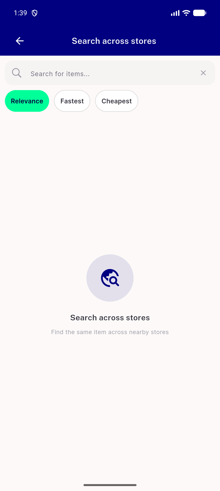
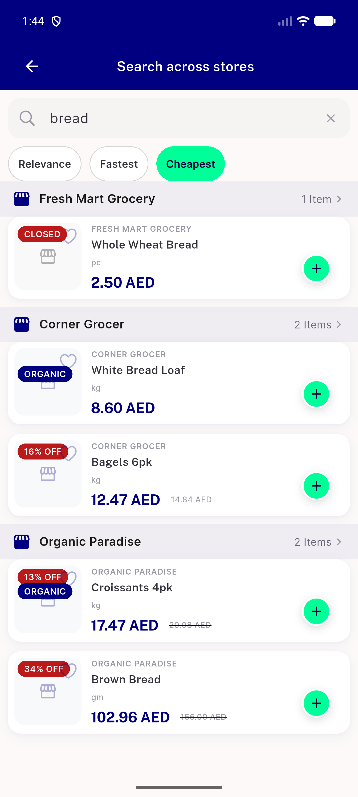
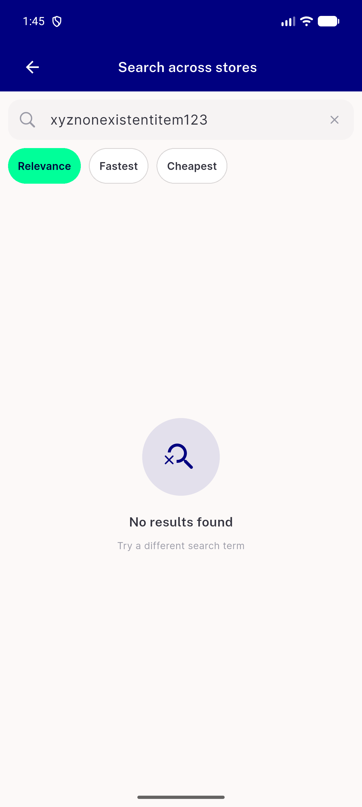
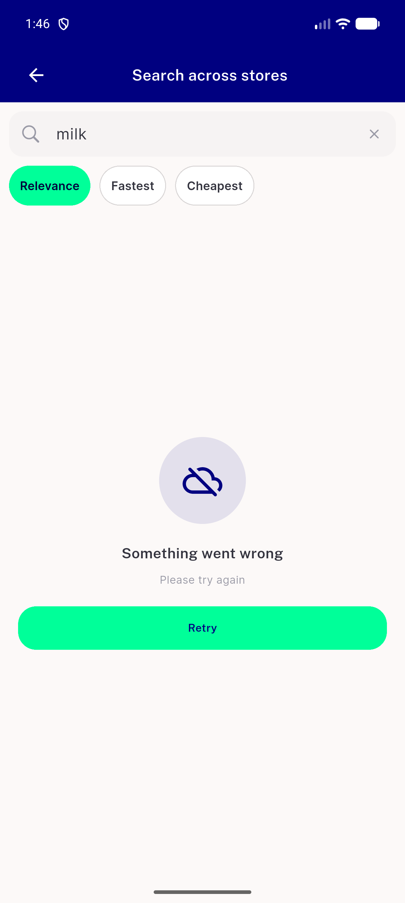
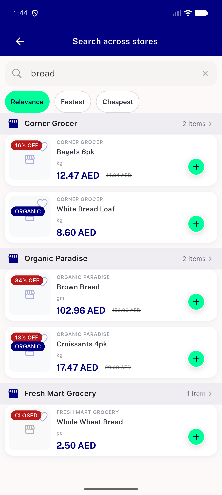
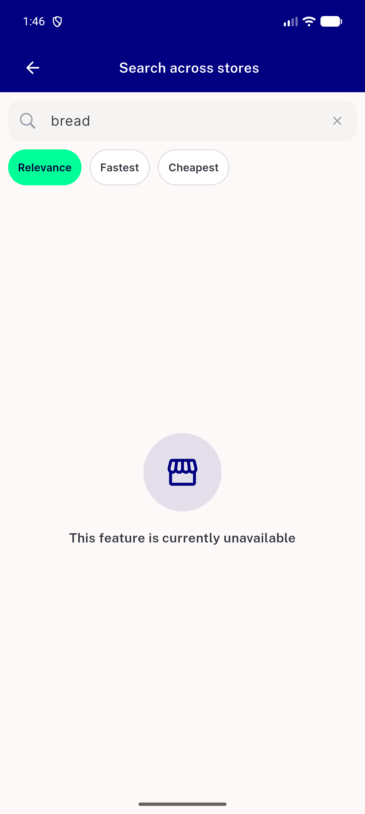

# QA Evidence — NEARS-2570

**PASS — cross-store search item rows on NItemCard(row), tap-through/sort/empty/error/disabled all demonstrated live**

**7 screenshot(s).** Click any thumbnail for full resolution.

<table>
<tr>
<td align="center" width="33%"> ac1 appbar search chips</td>
<td align="center" width="33%"> ac2 item tiles grouped results</td>
<td align="center" width="33%"> ac3 sort cheapest selected</td>
</tr>
<tr>
<td align="center" width="33%"> ac4 empty noresults</td>
<td align="center" width="33%"> ac5 error retry</td>
<td align="center" width="33%"> ac6 loading skeleton</td>
</tr>
<tr>
<td align="center" width="33%"> ac7 disabled backend gate</td>
</tr>
</table>

---
*From `nears/docs/qa-evidence/NEARS-2570/` · public-repo scrub policy (no live secrets; verified clean).*
