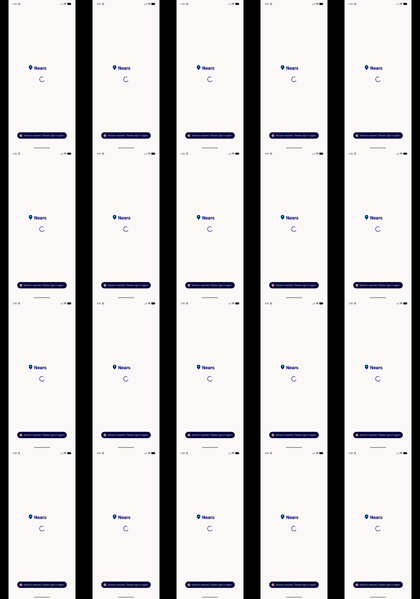

# QA Evidence — NEARS-2572

**PASS - splash ApiClient layering fix verified live on emulator-5556**

**1 screenshot(s).** Click any thumbnail for full resolution.

<table>
<tr>
<td align="center" width="33%"> ac3 corrupt token toast fires once</td>
</tr>
</table>

---
*From `nears/docs/qa-evidence/NEARS-2572/` · public-repo scrub policy (no live secrets; verified clean).*
