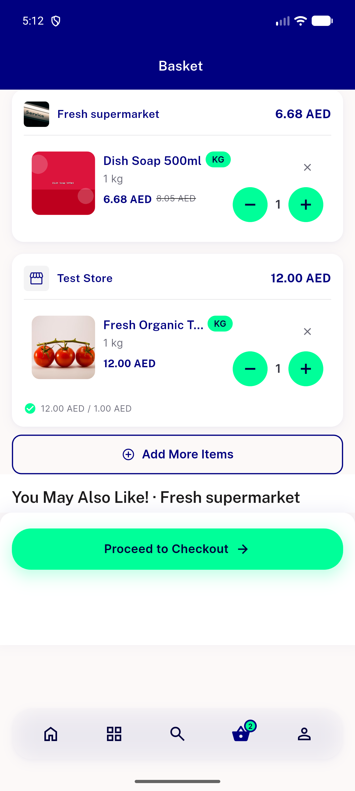
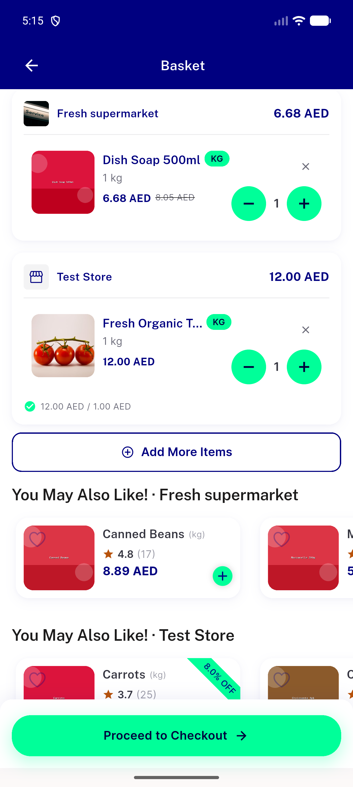
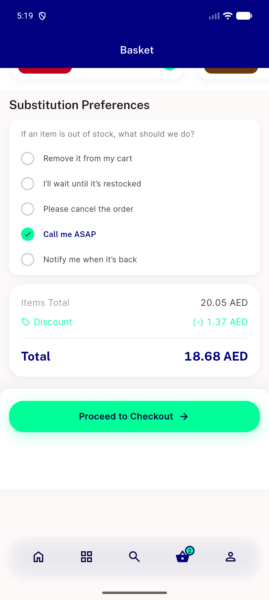
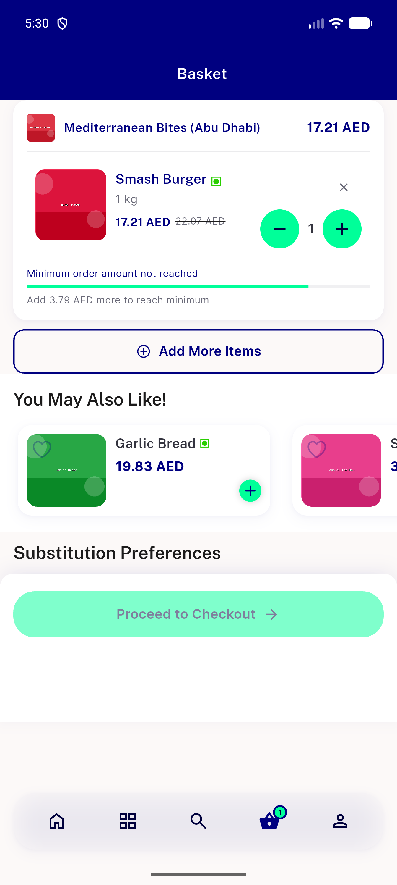
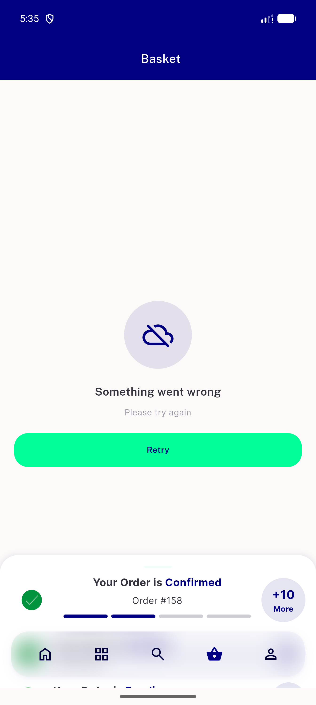
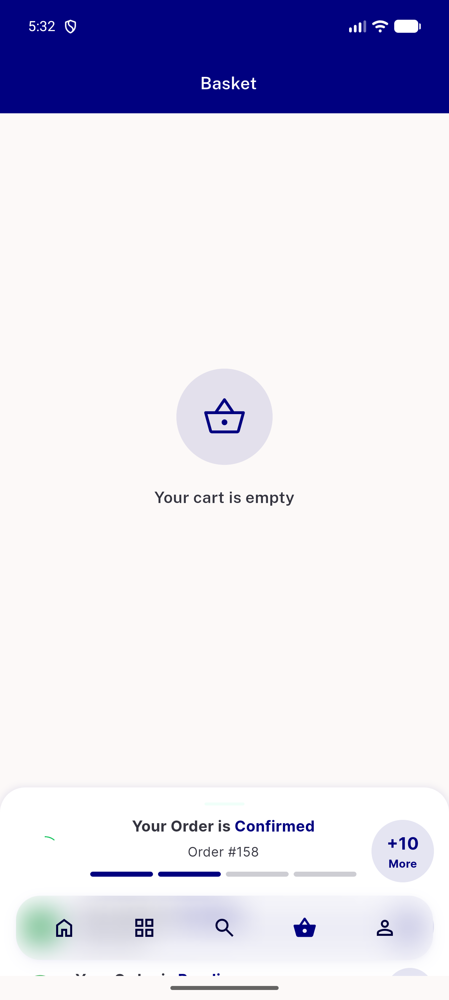
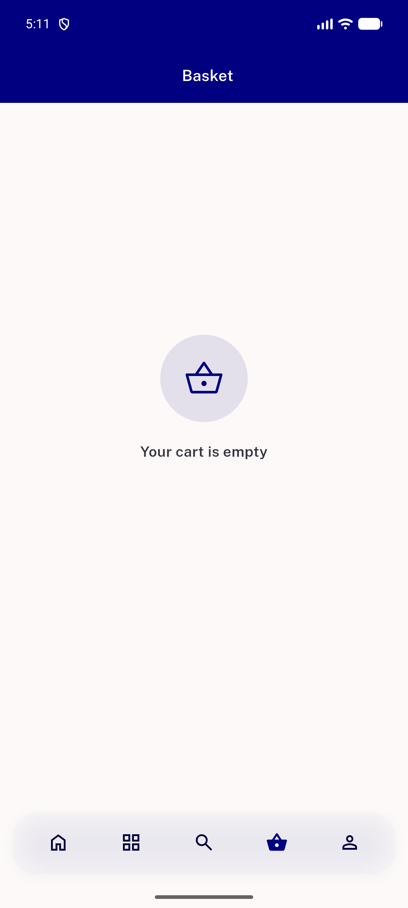
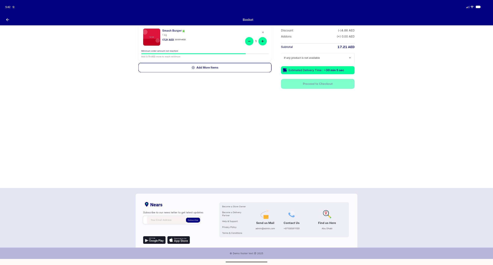
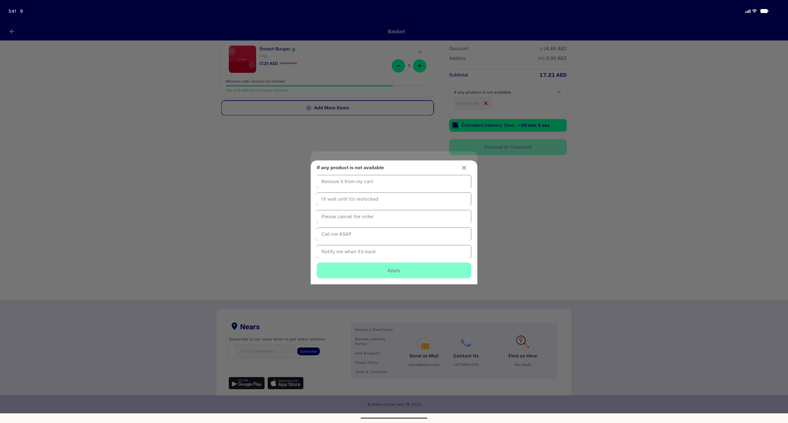

# QA Evidence — NEARS-2574

**PASS - cart_screen reskin: AC1-4,6,8 live PASS; AC5 code-verified (pre-existing NEARS-1623 unreachable); AC7 unverifiable (data gap, no seed store has cutlery/extra_packaging enabled); fix-cycle-1 regression (clearCartOnline silent reconciliation) confirmed fixed live + by test**

**10 screenshot(s).** Click any thumbnail for full resolution.

<table>
<tr>
<td align="center" width="33%"> ac1 ac2 cart multistore navtab</td>
<td align="center" width="33%"> ac2 cart route standalone</td>
<td align="center" width="33%"> ac2 ordersummary navtab full</td>
</tr>
<tr>
<td align="center" width="33%"> ac2 ordersummary navtab</td>
<td align="center" width="33%"> ac3 below minimum disabled</td>
<td align="center" width="33%"> ac4 error retry empty fetch</td>
</tr>
<tr>
<td align="center" width="33%"> ac6 empty cart confirmed</td>
<td align="center" width="33%"> ac6 empty cart navtab</td>
<td align="center" width="33%"> qapoint closex 44dp tapped</td>
</tr>
<tr>
<td align="center" width="33%"> qapoint notavailable modalsurface</td>
</tr>
</table>

---
*From `nears/docs/qa-evidence/NEARS-2574/` · public-repo scrub policy (no live secrets; verified clean).*
