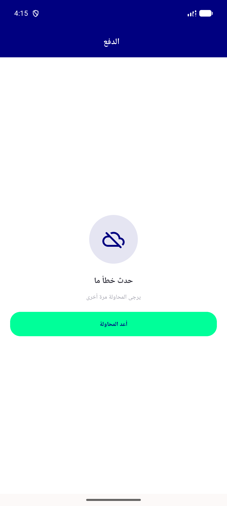
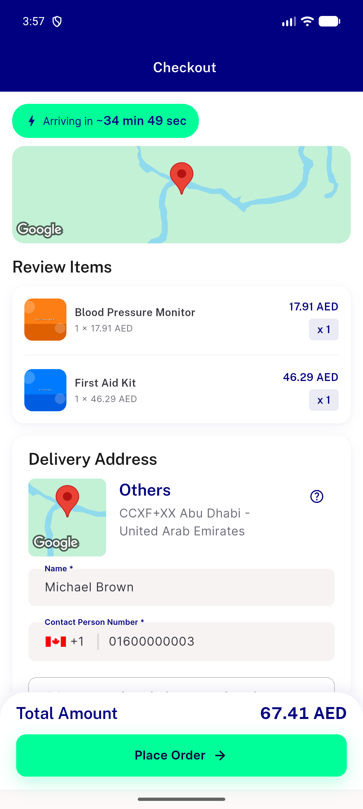
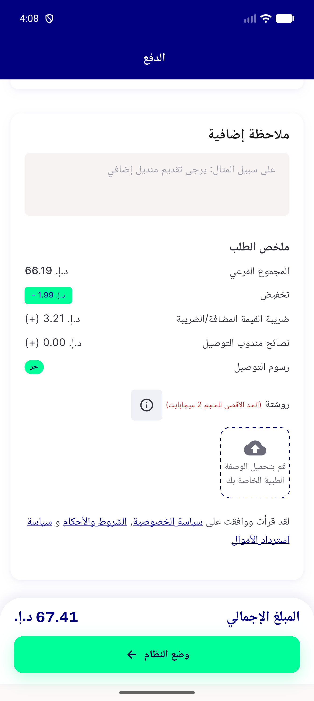
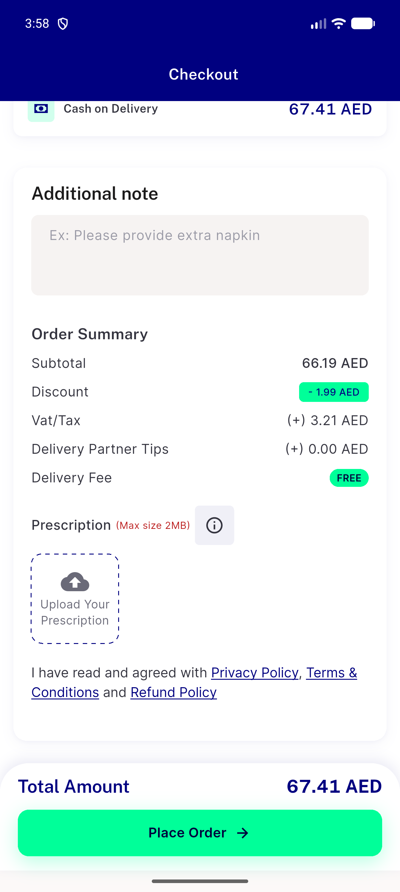
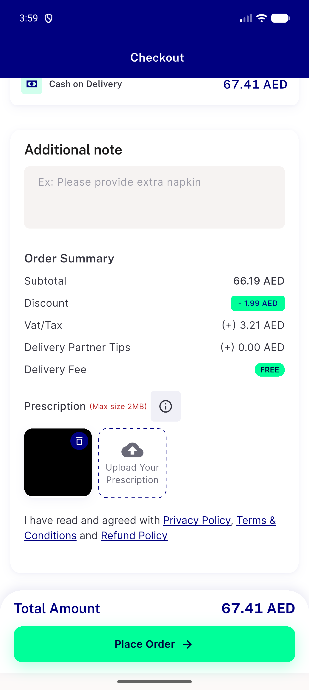

# QA Evidence — NEARS-2575

**PASS — checkout DLS reskin live-verified (light mode), AC1/2/3/4/5/6/7/8 covered, 1 pre-existing RTL overflow regression (NEARS-2404) confirmed**

**11 screenshot(s).** Click any thumbnail for full resolution.

<table>
<tr>
<td align="center" width="33%"> bug tips rtl overflow preexisting nears2404</td>
<td align="center" width="33%"> checkout generic error nerrorretry</td>
<td align="center" width="33%"> checkout main</td>
</tr>
<tr>
<td align="center" width="33%"> checkout rtl main</td>
<td align="center" width="33%"> checkout rtl scroll1</td>
<td align="center" width="33%"> checkout rtl scroll2</td>
</tr>
<tr>
<td align="center" width="33%"> checkout scroll1</td>
<td align="center" width="33%"> checkout scroll2</td>
<td align="center" width="33%"> coupon applied rtl</td>
</tr>
<tr>
<td align="center" width="33%"> rx thumbnail rtl</td>
<td align="center" width="33%"> rx thumbnail</td>
</tr>
</table>

### Other artifacts
- [`session-fail-log-excerpt.log`](session-fail-log-excerpt.log)

---
*From `nears/docs/qa-evidence/NEARS-2575/` · public-repo scrub policy (no live secrets; verified clean).*
