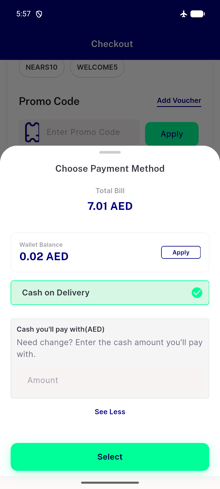
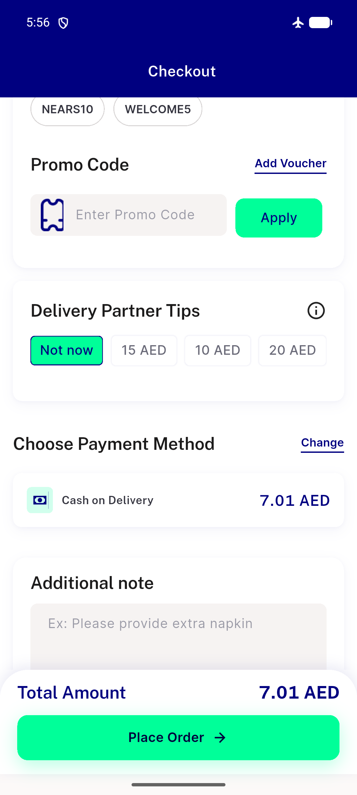
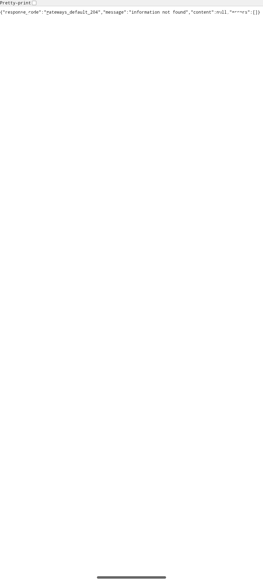
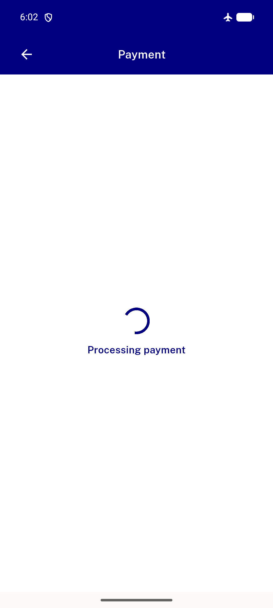
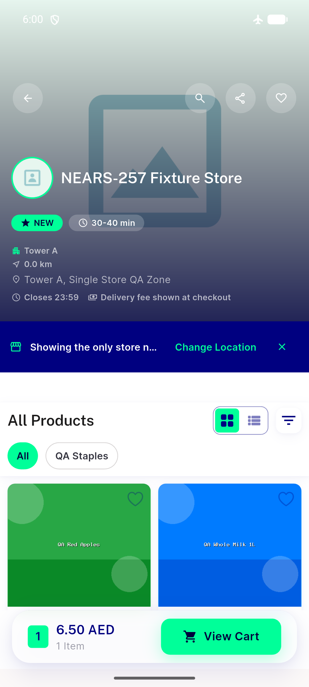

# QA Evidence — NEARS-2576

**PASS (code+widget-test verified; live entry to order_successful_screen blocked by absent Gateways module, precedented NEARS-403) — F2 cancelled-order/digital-payment precondition reproduced live in DB**

**5 screenshot(s).** Click any thumbnail for full resolution.

<table>
<tr>
<td align="center" width="33%"> checkout cod only zone2</td>
<td align="center" width="33%"> checkout payment method picker</td>
<td align="center" width="33%"> gateway broken 204 response</td>
</tr>
<tr>
<td align="center" width="33%"> payment processing placeholder</td>
<td align="center" width="33%"> zone3 fixture store</td>
</tr>
</table>

### Other artifacts
- [`flutter-test-output.log`](flutter-test-output.log)
- [`live-db-evidence.log`](live-db-evidence.log)
- [`progress.md`](progress.md)

---
*From `nears/docs/qa-evidence/NEARS-2576/` · public-repo scrub policy (no live secrets; verified clean).*
