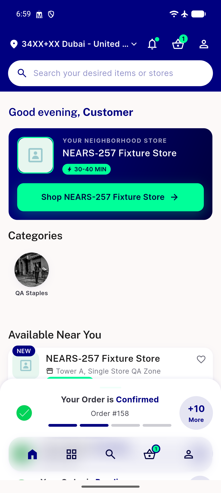
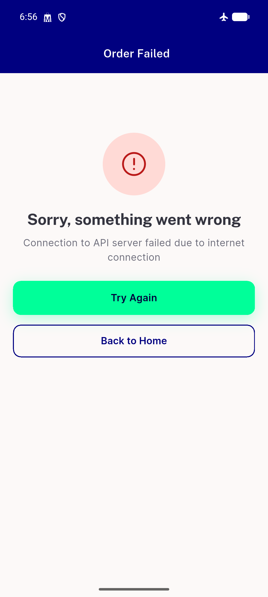
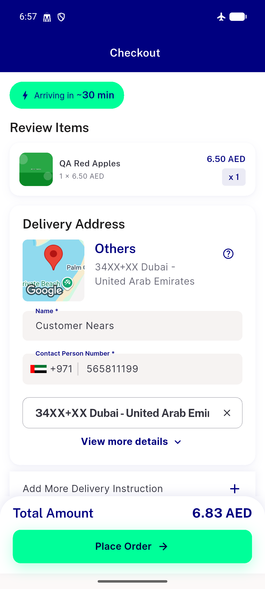

# QA Evidence — NEARS-2577

**PASS — NIcon/NText reskin verification, live checkout+failure+retry+back-to-home flow, semantic-red preserved, no raw remnants**

**3 screenshot(s).** Click any thumbnail for full resolution.

<table>
<tr>
<td align="center" width="33%"> back to home lands on dashboard</td>
<td align="center" width="33%"> error screen light</td>
<td align="center" width="33%"> retry returns checkout state intact</td>
</tr>
</table>

### Other artifacts
- [`bug-checkout-distance-parse-typeerror.log`](bug-checkout-distance-parse-typeerror.log)

---
*From `nears/docs/qa-evidence/NEARS-2577/` · public-repo scrub policy (no live secrets; verified clean).*
