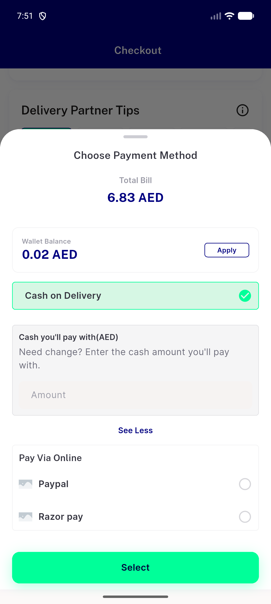
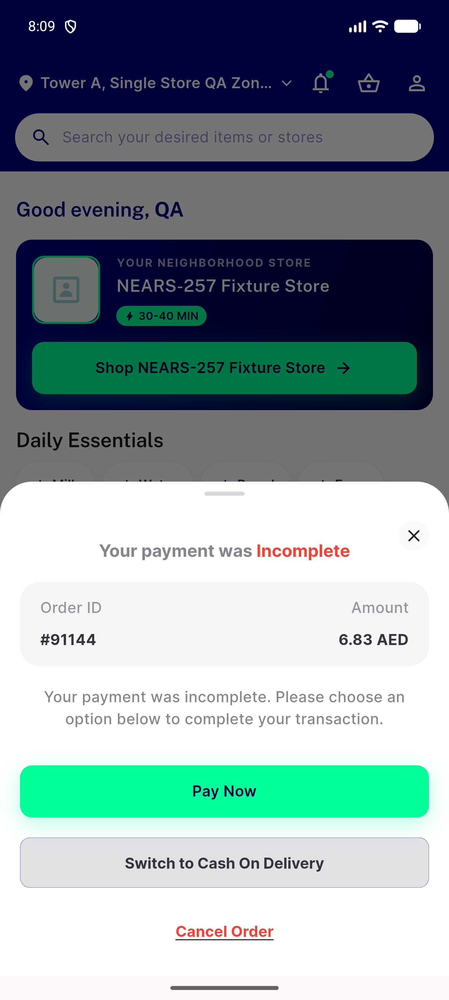
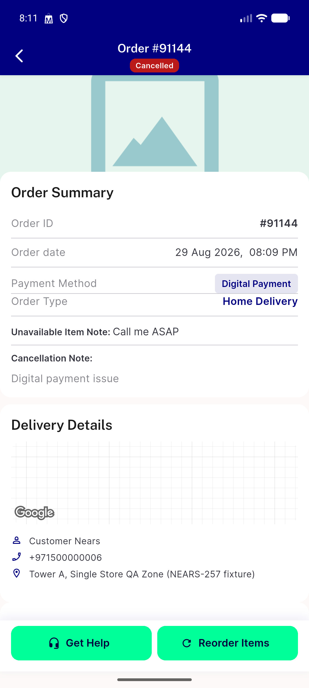
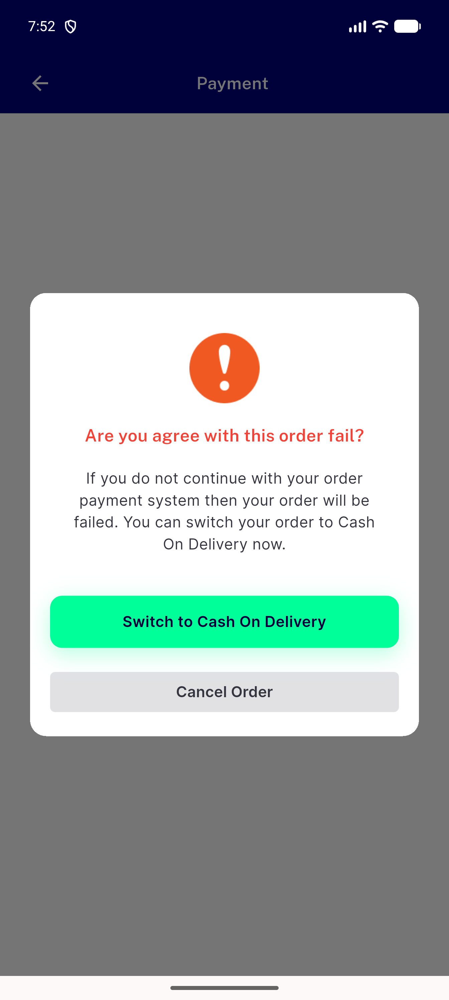
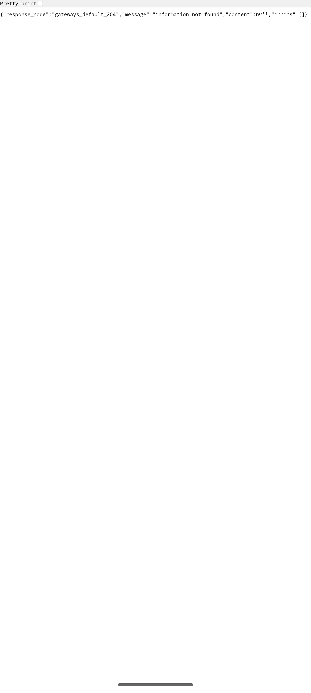

# QA Evidence — NEARS-2578

**BLOCKED (partial) — screen unreachable via live UI navigation (Gateways module absent); widget-suite 62/62 pass + live real-order regression evidence attached**

**6 screenshot(s).** Click any thumbnail for full resolution.

<table>
<tr>
<td align="center" width="33%"> checkout digital payment selection</td>
<td align="center" width="33%"> home payment incomplete bottomsheet 2</td>
<td align="center" width="33%"> home payment incomplete bottomsheet</td>
</tr>
<tr>
<td align="center" width="33%"> order details 91144 cancelled unaffected</td>
<td align="center" width="33%"> payment back guard dialog</td>
<td align="center" width="33%"> payment webview gateways module absent</td>
</tr>
</table>

---
*From `nears/docs/qa-evidence/NEARS-2578/` · public-repo scrub policy (no live secrets; verified clean).*
