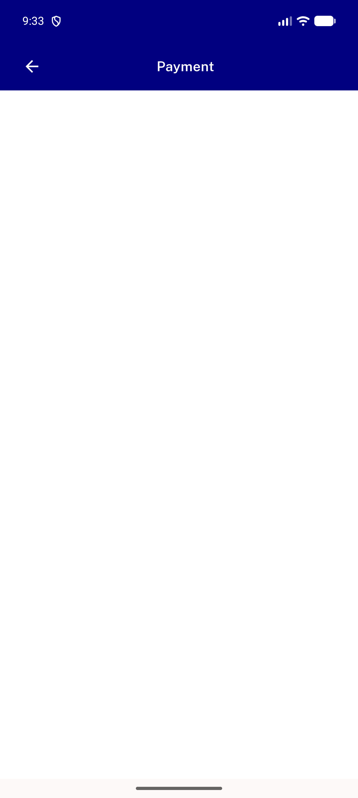
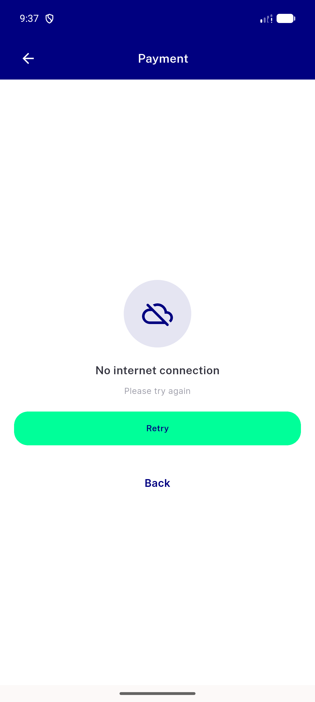
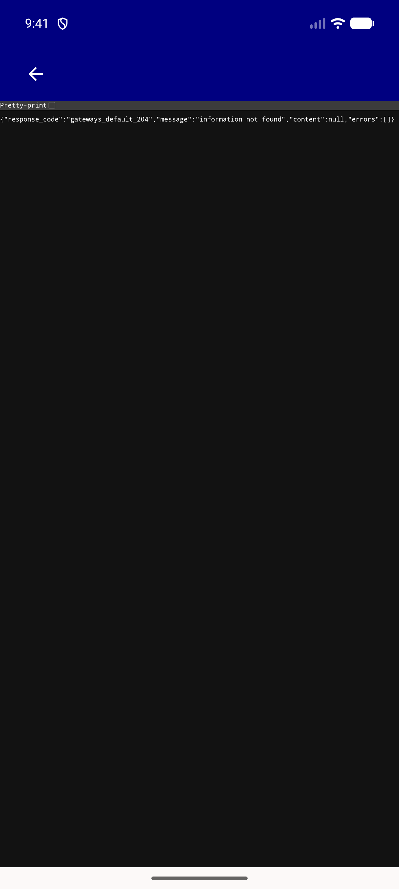
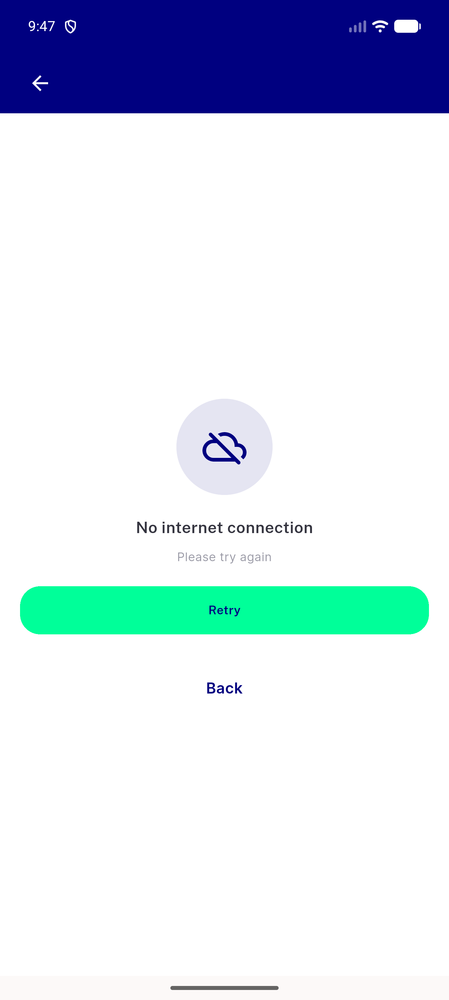
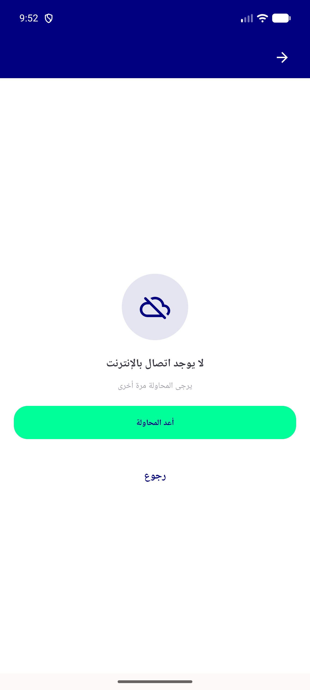

# QA Evidence — NEARS-2579

**PASS — payment_screen.dart + payment_webview_screen.dart error-retry overlay, spinner fix, F1/F2 double-open guard live-verified emulator-5556**

**5 screenshot(s).** Click any thumbnail for full resolution.

<table>
<tr>
<td align="center" width="33%"> ac1 ac4 payment screen appbar</td>
<td align="center" width="33%"> ac2 payment screen connectivity error</td>
<td align="center" width="33%"> ac3 ac4 payment webview screen appbar</td>
</tr>
<tr>
<td align="center" width="33%"> ac3 payment webview screen connectivity error</td>
<td align="center" width="33%"> rtl payment webview error retry</td>
</tr>
</table>

### Other artifacts
- [`bug-wallet-exit-shows-order-dialog.log`](bug-wallet-exit-shows-order-dialog.log)

---
*From `nears/docs/qa-evidence/NEARS-2579/` · public-repo scrub policy (no live secrets; verified clean).*
