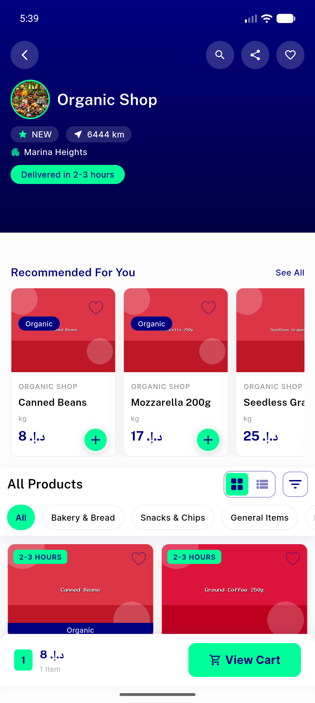
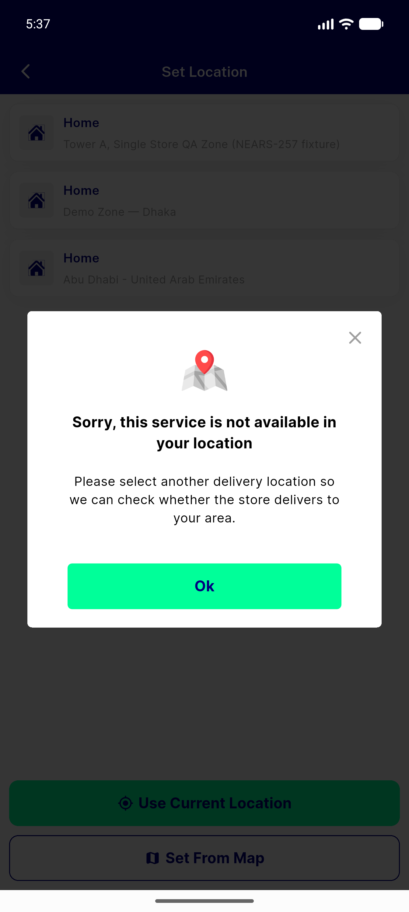
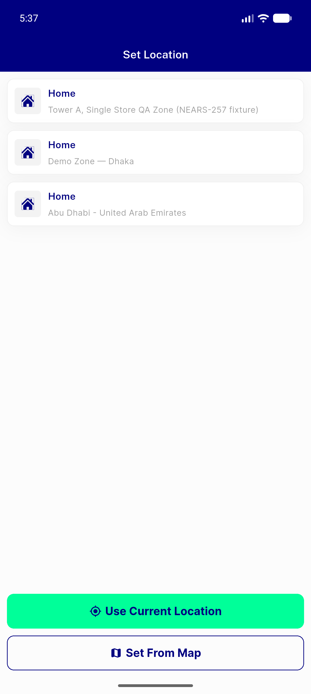
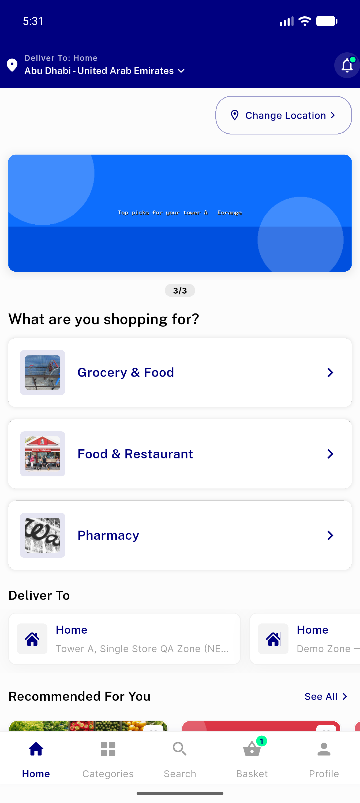

# QA Evidence — NEARS-258

**4 screenshot(s).** Click any thumbnail for full resolution.

<table>
<tr>
<td align="center" width="33%"> multisector store open</td>
<td align="center" width="33%"> picker zone2 after switchback</td>
<td align="center" width="33%"> picker zone2 final</td>
</tr>
<tr>
<td align="center" width="33%"> picker zone2 initial</td>
</tr>
</table>

---
*From `nears/docs/qa-evidence/NEARS-258/` · public-repo scrub policy (no live secrets; verified clean).*
