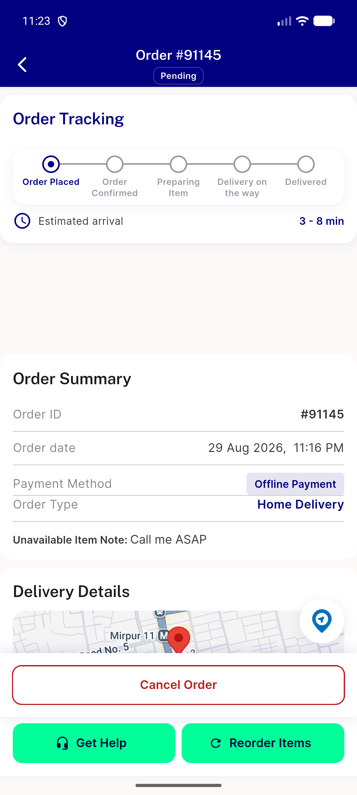
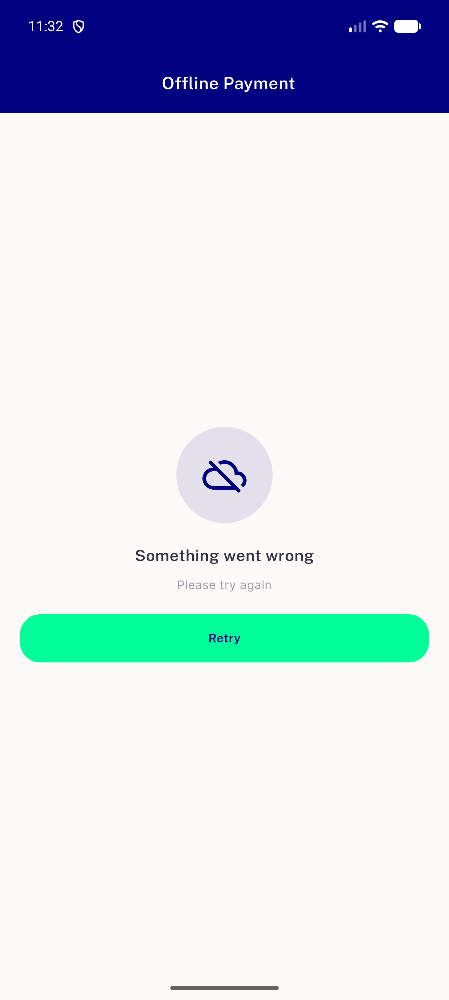

# QA Evidence — NEARS-2580

**FAIL - AC1 blocked by live Map.forEach crash on genuine-zero-methods; AC2/AC3/AC4/RTL demonstrated live and clean; 1 pre-existing regression logged**

**7 screenshot(s).** Click any thumbnail for full resolution.

<table>
<tr>
<td align="center" width="33%"> ac1 error retry state</td>
<td align="center" width="33%"> ac2 retry recovered</td>
<td align="center" width="33%"> ac3 rtl submit fail toast</td>
</tr>
<tr>
<td align="center" width="33%"> ac3 submit fail toast</td>
<td align="center" width="33%"> ac3 submit success navigated</td>
<td align="center" width="33%"> ac6 loaded carousel</td>
</tr>
<tr>
<td align="center" width="33%"> bug empty methods map forEach crash</td>
</tr>
</table>

### Other artifacts
- [`bug-empty-methods-map-forEach-crash.log`](bug-empty-methods-map-forEach-crash.log)
- [`bug-payment-section-row-overflow.log`](bug-payment-section-row-overflow.log)

---
*From `nears/docs/qa-evidence/NEARS-2580/` · public-repo scrub policy (no live secrets; verified clean).*
