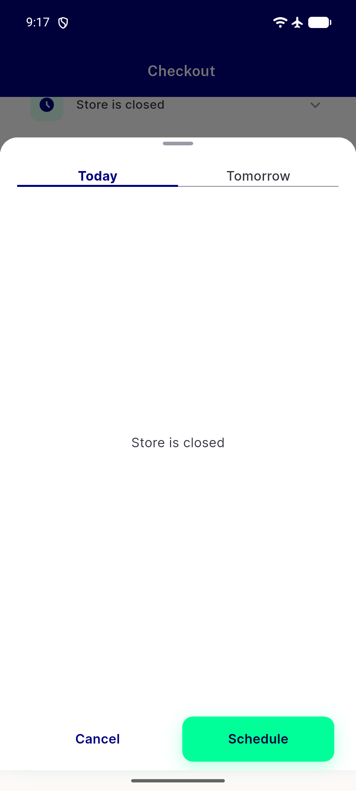
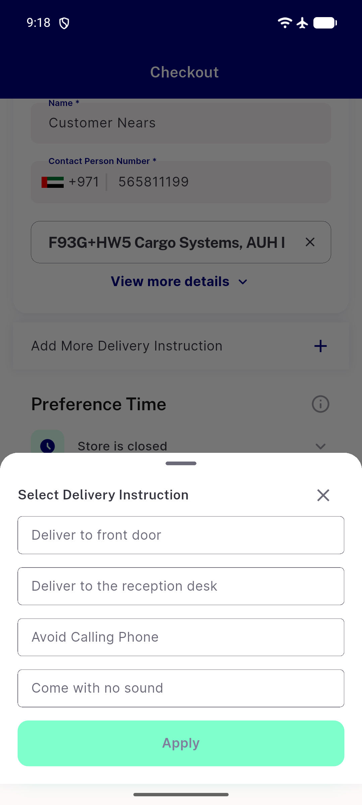

# QA Evidence — NEARS-2584

**PASS — collapse dead isMobile branches, all 4 ACs demonstrated live, 3 pre-existing regressions confirmed unrelated**

**8 screenshot(s).** Click any thumbnail for full resolution.

<table>
<tr>
<td align="center" width="33%"> boot</td>
<td align="center" width="33%"> item bottom sheet</td>
<td align="center" width="33%"> cart screen</td>
</tr>
<tr>
<td align="center" width="33%"> payment method sheet</td>
<td align="center" width="33%"> coupon bottom sheet</td>
<td align="center" width="33%"> time slot sheet</td>
</tr>
<tr>
<td align="center" width="33%"> delivery instruction sheet</td>
<td align="center" width="33%"> coupon screen</td>
</tr>
</table>

### Other artifacts
- [`bug-checkout-distance-parse-preexisting.log`](bug-checkout-distance-parse-preexisting.log)
- [`bug-flutter-test-preexisting-failures.log`](bug-flutter-test-preexisting-failures.log)

---
*From `nears/docs/qa-evidence/NEARS-2584/` · public-repo scrub policy (no live secrets; verified clean).*
