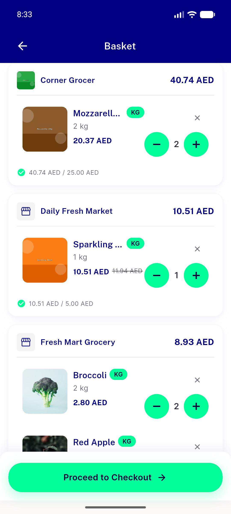
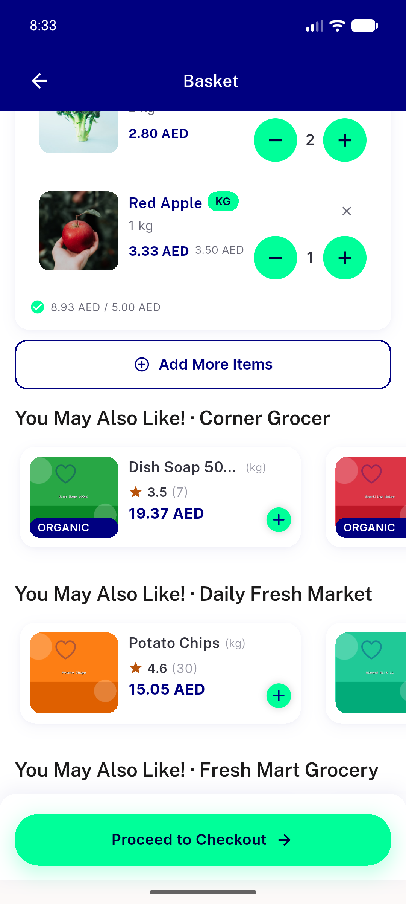
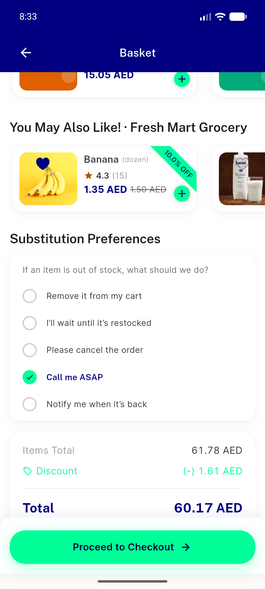

# QA Evidence — NEARS-2585

**QA FAIL: AC1/AC2 (DB seed) PASS live; AC3 (cart-screen toggles) FAIL — cutlery/extra-packaging widgets dead on mobile render path**

**3 screenshot(s).** Click any thumbnail for full resolution.

<table>
<tr>
<td align="center" width="33%"> bug cutlery extrapackaging dead mobile path 01</td>
<td align="center" width="33%"> bug cutlery extrapackaging dead mobile path 02</td>
<td align="center" width="33%"> bug cutlery extrapackaging dead mobile path 03 bottom</td>
</tr>
</table>

### Other artifacts
- [`bug-cutlery-extrapackaging-dead-mobile-path.xml`](bug-cutlery-extrapackaging-dead-mobile-path.xml)

---
*From `nears/docs/qa-evidence/NEARS-2585/` · public-repo scrub policy (no live secrets; verified clean).*
