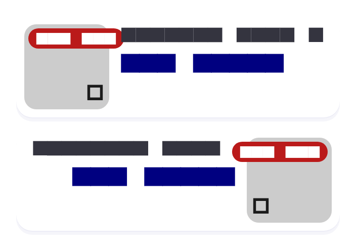
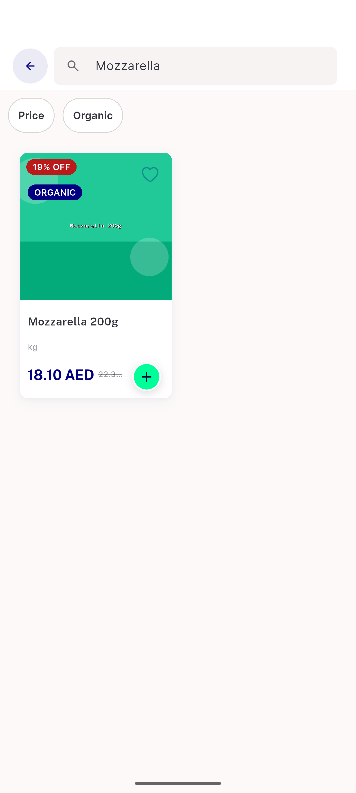

# QA Evidence — NEARS-2587

**PASS — NItemCard row layout: 8/8 AC demonstrated live via widget-test visual dump + real device grid-regression pass**

**3 screenshot(s).** Click any thumbnail for full resolution.

<table>
<tr>
<td align="center" width="33%"> ac1 ac3 ac5 row default and skeleton</td>
<td align="center" width="33%"> ac4 rtl vs ltr mirror</td>
<td align="center" width="33%"> ac8 grid regression store item search</td>
</tr>
</table>

---
*From `nears/docs/qa-evidence/NEARS-2587/` · public-repo scrub policy (no live secrets; verified clean).*
