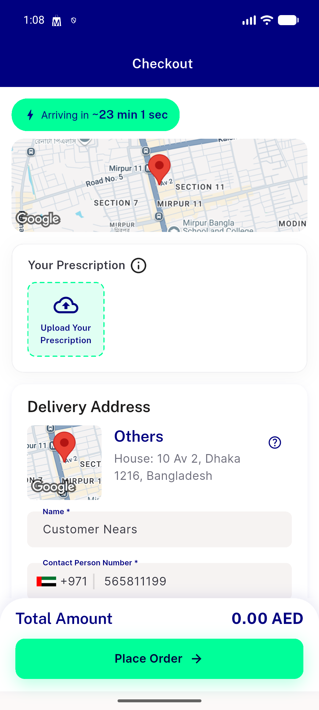
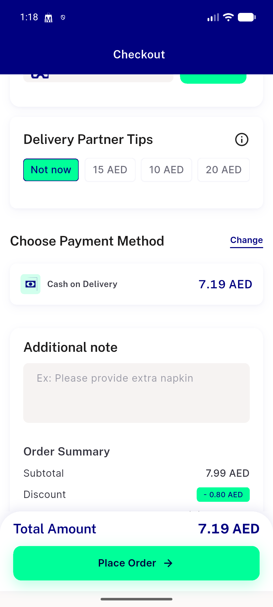
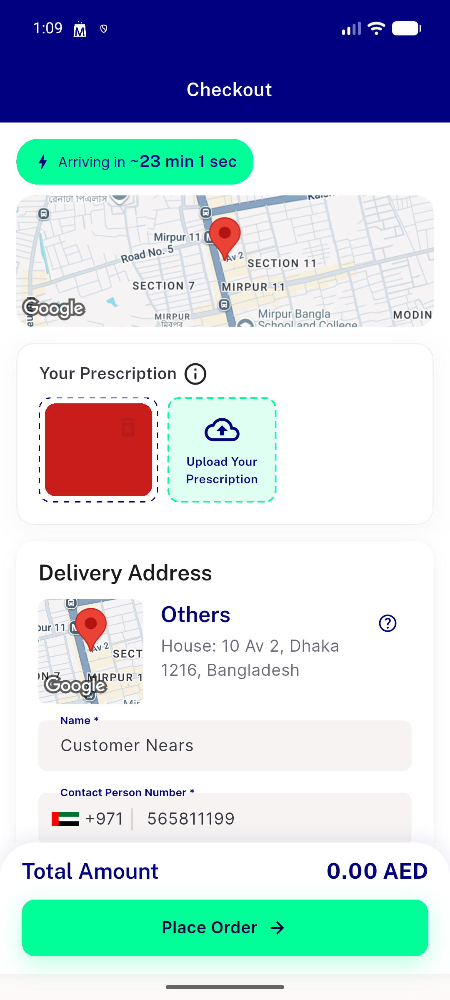

# QA Evidence — NEARS-2590

**PASS — Rx remove badge error-token fix; AC1/AC3 unverifiable-live (no cart-checkout entry point, pre-existing regression), AC2 unverifiable (dark deferred), light-mode regression clean**

**3 screenshot(s).** Click any thumbnail for full resolution.

<table>
<tr>
<td align="center" width="33%"> ac2 topsection light before upload</td>
<td align="center" width="33%"> bug no rx picker cart checkout</td>
<td align="center" width="33%"> topsection light remove badge</td>
</tr>
</table>

### Other artifacts
- [`bug-get-tax-403.log`](bug-get-tax-403.log)

---
*From `nears/docs/qa-evidence/NEARS-2590/` · public-repo scrub policy (no live secrets; verified clean).*
