# QA Evidence — NEARS-2592

**PASS — NUploadTile promotion: 7/7 migrated call sites verified live (light mode), AC1/AC2/AC3 all met, 0 new failures, 9 pre-existing failures confirmed unrelated**

**13 screenshot(s).** Click any thumbnail for full resolution.

<table>
<tr>
<td align="center" width="33%"><a href="ac1-checkout-prescription-empty.png">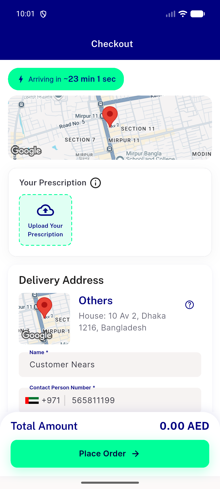</a> ac1 checkout prescription empty</td>
<td align="center" width="33%"><a href="ac1-dm-reg-identity-desktop.png">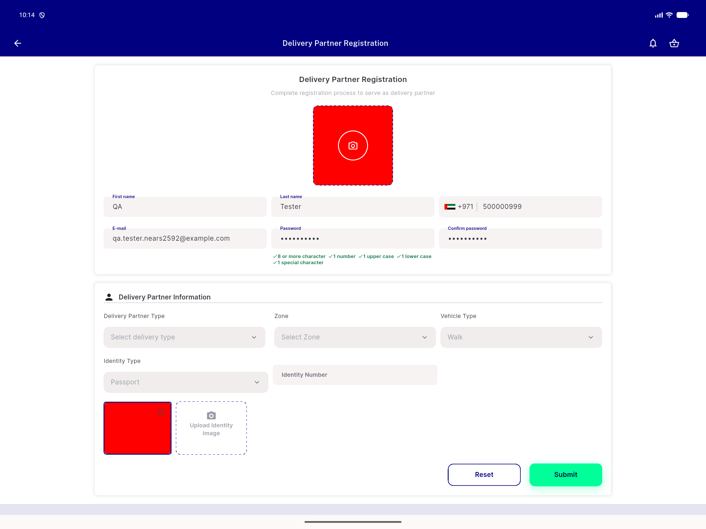</a> ac1 dm reg identity desktop</td>
<td align="center" width="33%"><a href="ac1-dm-reg-identity-mobile-empty.png">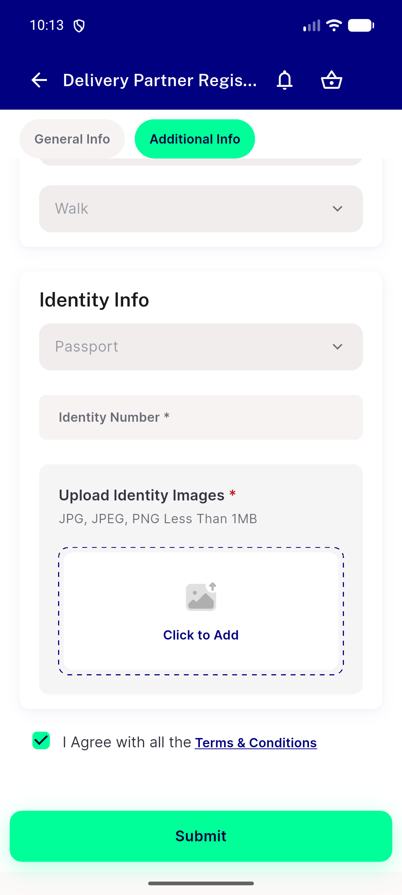</a> ac1 dm reg identity mobile empty</td>
</tr>
<tr>
<td align="center" width="33%"><a href="ac1-dm-reg-identity-mobile-filled.png">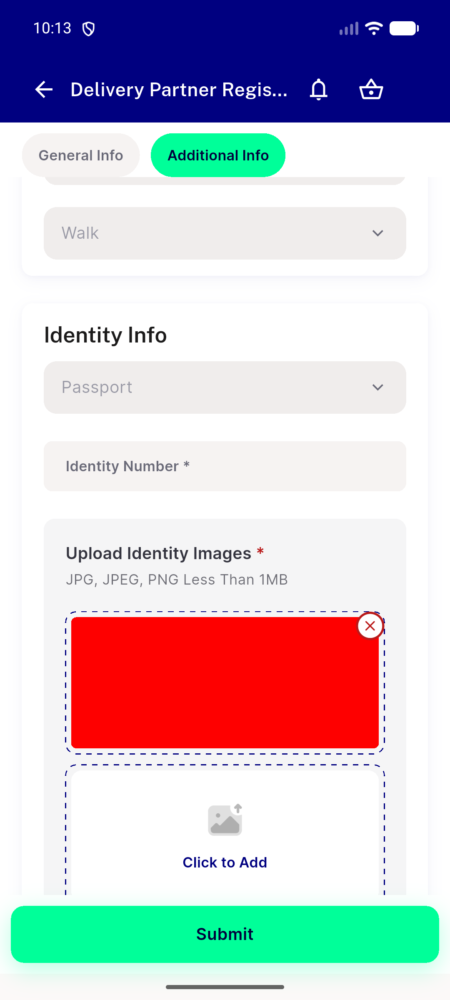</a> ac1 dm reg identity mobile filled</td>
<td align="center" width="33%"><a href="ac1-refund-request-empty.png">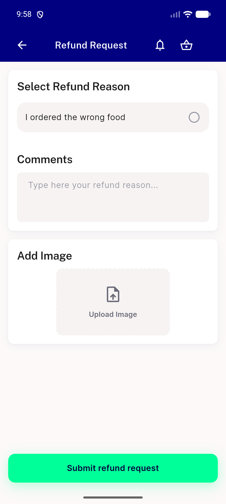</a> ac1 refund request empty</td>
<td align="center" width="33%"><a href="ac1-refund-request-filled.png">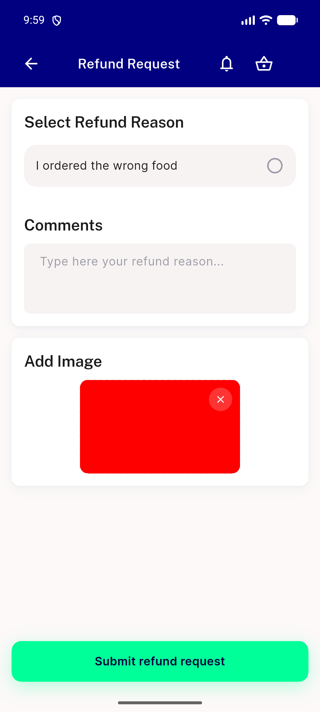</a> ac1 refund request filled</td>
</tr>
<tr>
<td align="center" width="33%"><a href="ac1-store-reg-tin-desktop-empty.png">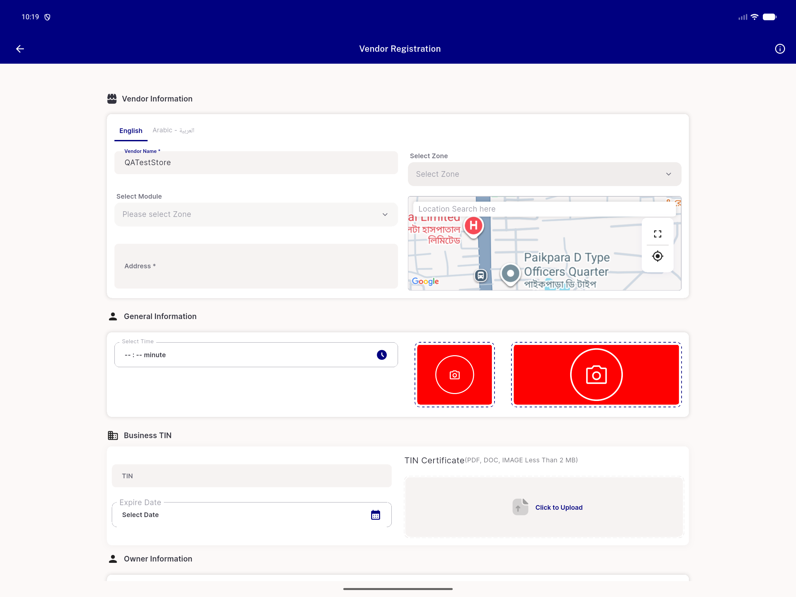</a> ac1 store reg tin desktop empty</td>
<td align="center" width="33%"> ac1 store reg tin desktop filled</td>
<td align="center" width="33%"><a href="ac1-store-reg-tin-mobile-empty.png">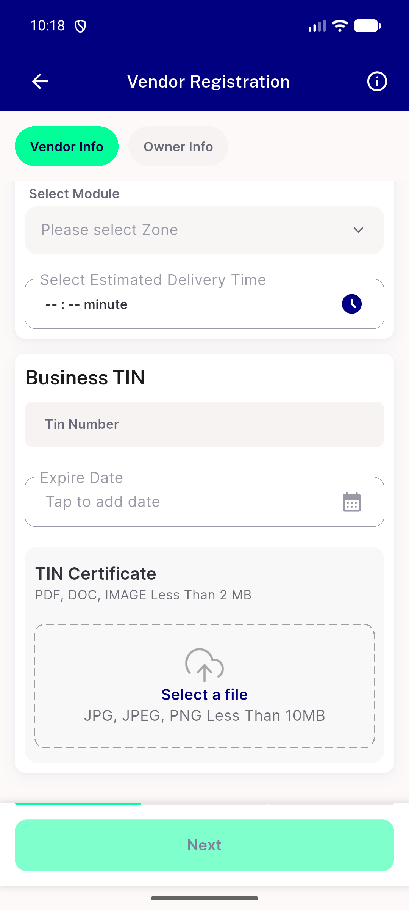</a> ac1 store reg tin mobile empty</td>
</tr>
<tr>
<td align="center" width="33%"><a href="ac1-store-reg-tin-mobile-filled.png">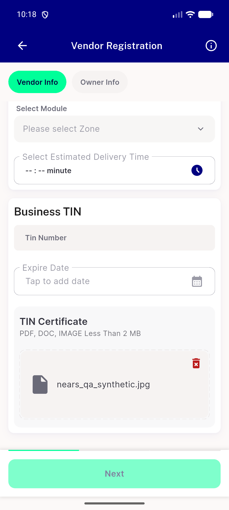</a> ac1 store reg tin mobile filled</td>
<td align="center" width="33%"><a href="regression-dm-reg-profile-photo-mobile.png">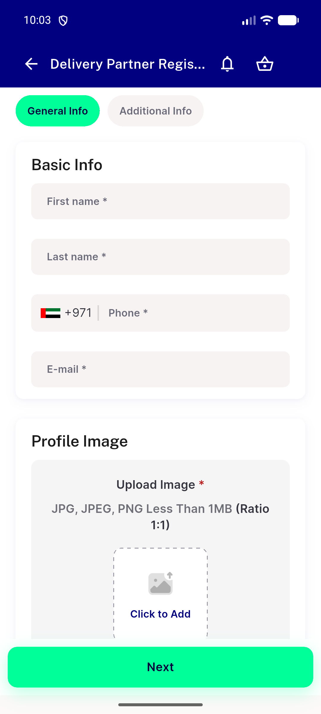</a> regression dm reg profile photo mobile</td>
<td align="center" width="33%"><a href="regression-store-reg-logo-cover-mobile.png">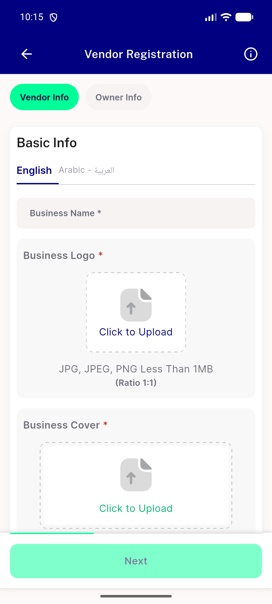</a> regression store reg logo cover mobile</td>
</tr>
<tr>
<td align="center" width="33%"> rtl refund request</td>
</tr>
</table>

---
*From `nears/docs/qa-evidence/NEARS-2592/` · public-repo scrub policy (no live secrets; verified clean).*
