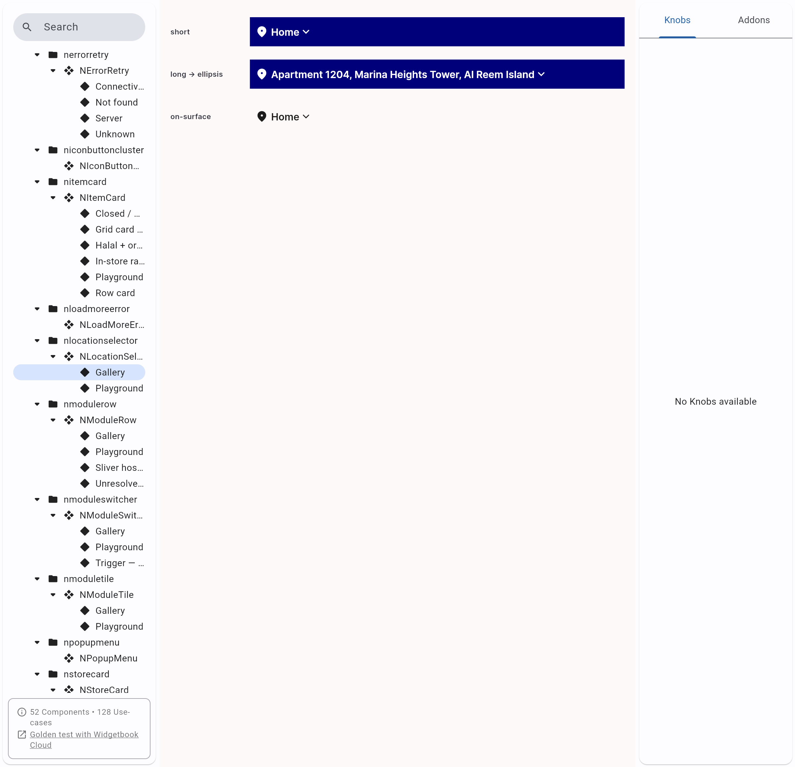
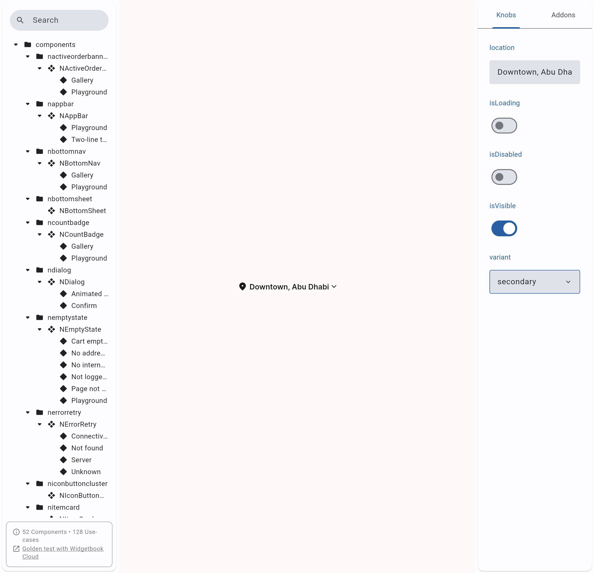
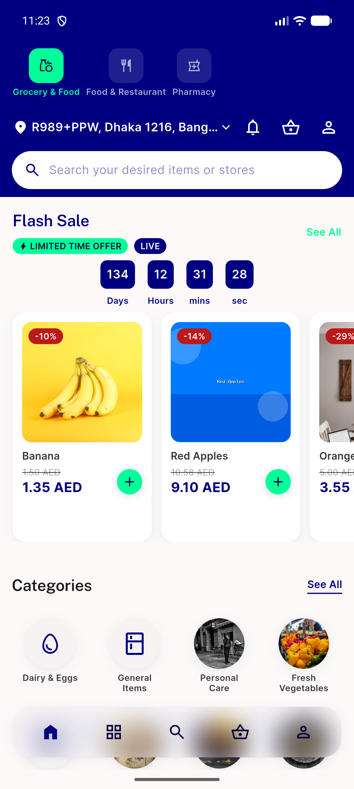
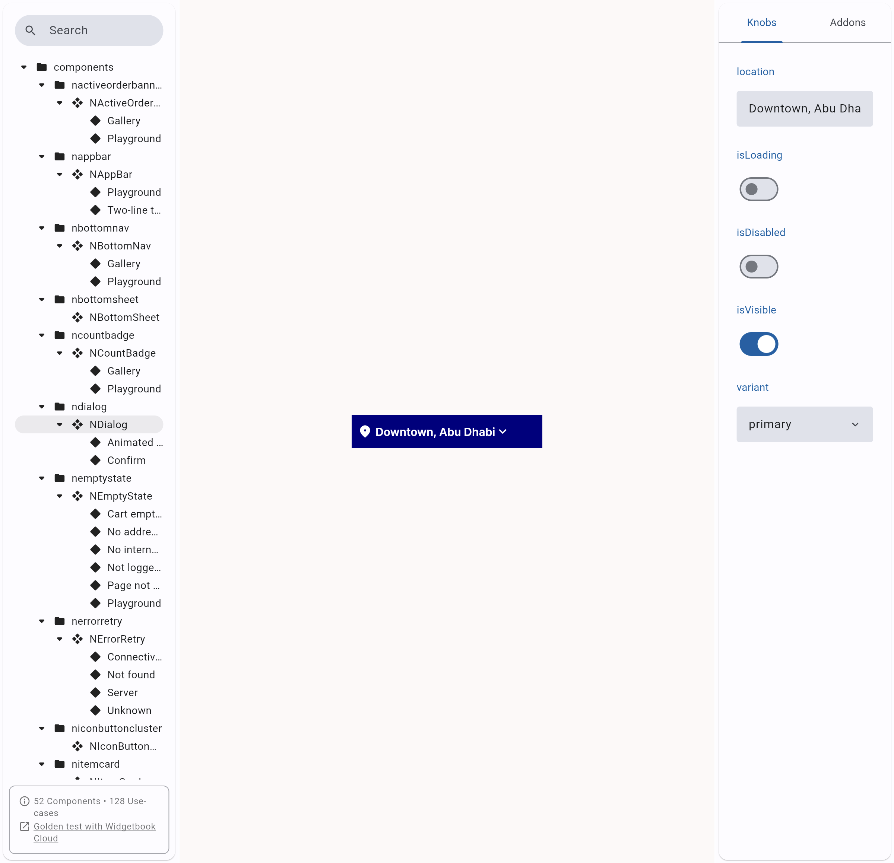

# QA Evidence — NEARS-2593

**PASS (delta) - Android live-device leg of AC2 (NAppBar location row unchanged on real device) closed, emulator-5560**

**4 screenshot(s).** Click any thumbnail for full resolution.

<table>
<tr>
<td align="center" width="33%"> ac1 ac2 gallery onsurface onnavy</td>
<td align="center" width="33%"> ac1 ac3 playground secondary onsurface</td>
<td align="center" width="33%"> ac2 android home nappbar location</td>
</tr>
<tr>
<td align="center" width="33%"> ac2 playground default onnavy</td>
</tr>
</table>

---
*From `nears/docs/qa-evidence/NEARS-2593/` · public-repo scrub policy (no live secrets; verified clean).*
