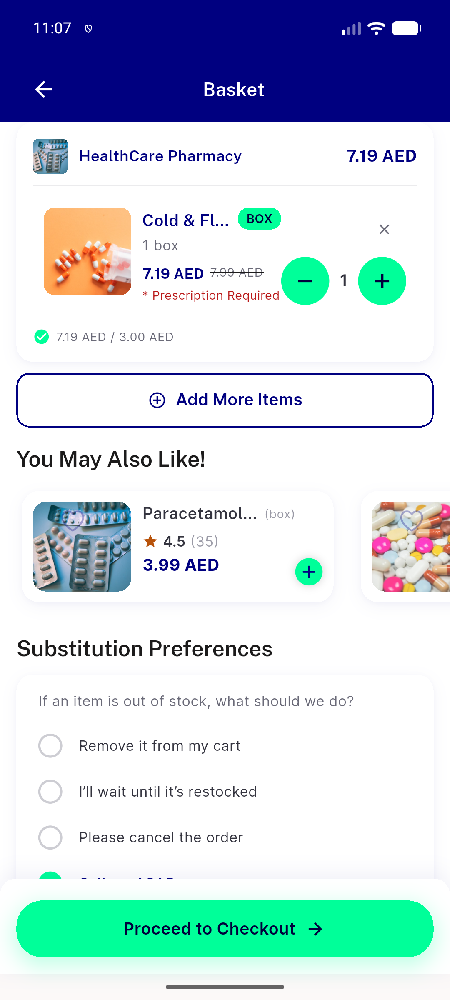
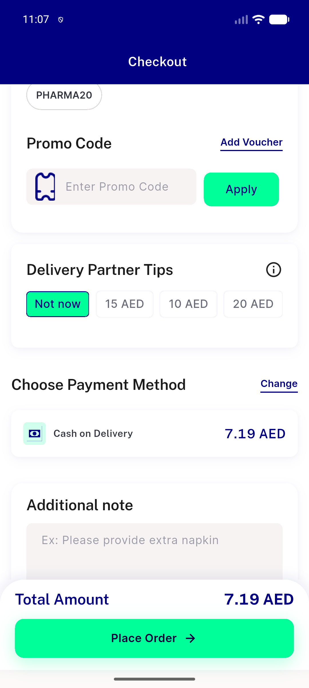
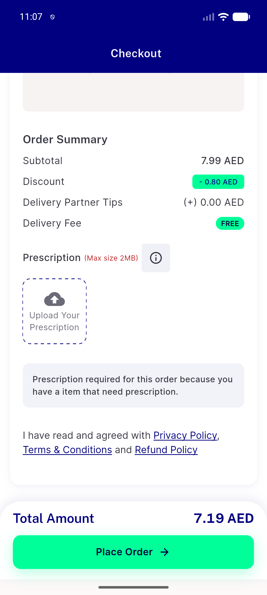
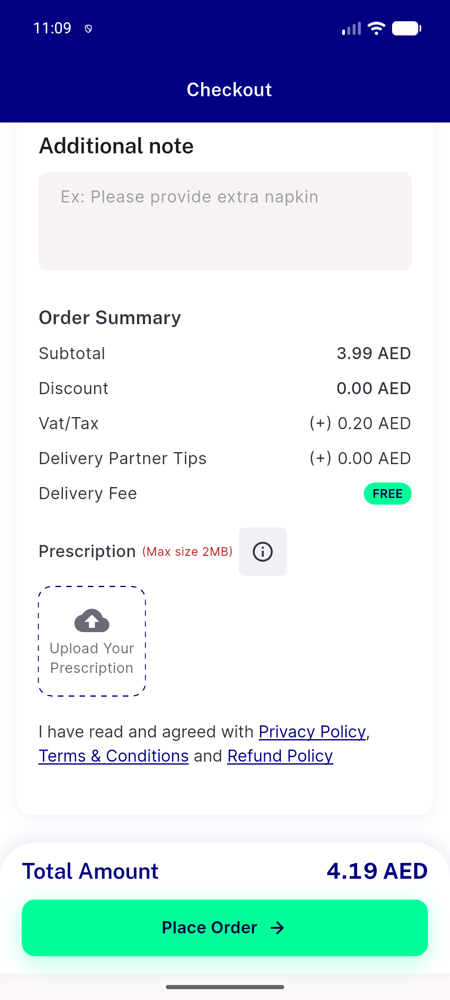
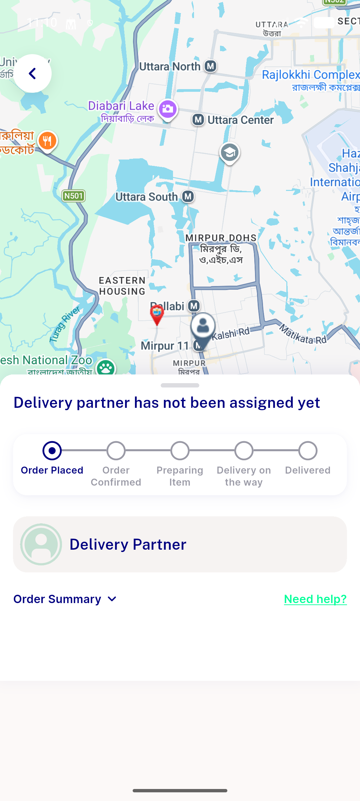

# QA Evidence — NEARS-2594

**PASS — pharmacy Rx-required seeder verified live (positive gate + negative control), seeder idempotent, no regressions**

**6 screenshot(s).** Click any thumbnail for full resolution.

<table>
<tr>
<td align="center" width="33%"> ac2 cart prescription required badge</td>
<td align="center" width="33%"> ac2 checkout prescription banner</td>
<td align="center" width="33%"> ac2 checkout upload prescription section</td>
</tr>
<tr>
<td align="center" width="33%"> ac2 place order gated snackbar</td>
<td align="center" width="33%"> negctrl checkout no rx banner</td>
<td align="center" width="33%"> negctrl order placed not gated</td>
</tr>
</table>

---
*From `nears/docs/qa-evidence/NEARS-2594/` · public-repo scrub policy (no live secrets; verified clean).*
