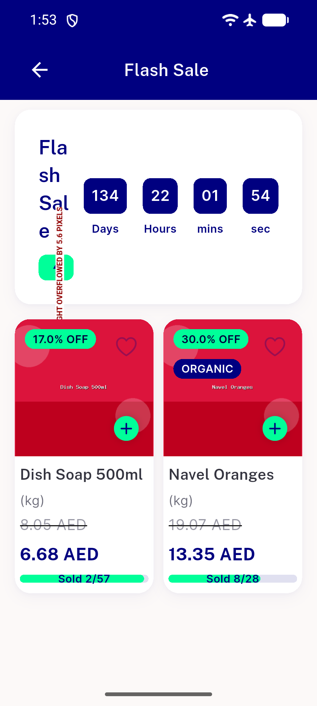

# QA Evidence — NEARS-2595

**FAIL — badge Row RenderFlex overflow persists at 320dp (real countdown data), en+ar**

**1 screenshot(s).** Click any thumbnail for full resolution.

<table>
<tr>
<td align="center" width="33%"> bug badge row overflow 320dp</td>
</tr>
</table>

---
*From `nears/docs/qa-evidence/NEARS-2595/` · public-repo scrub policy (no live secrets; verified clean).*
