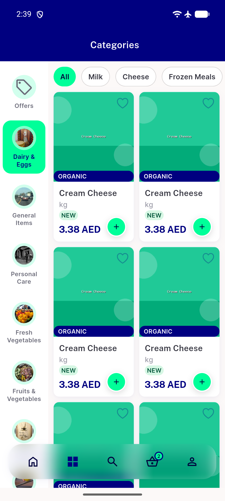
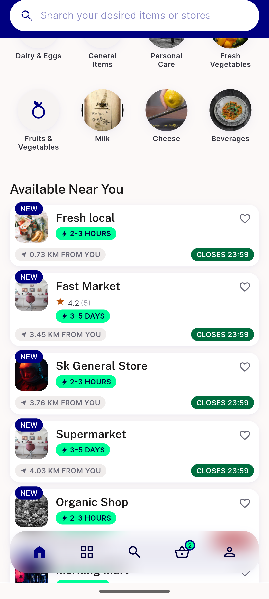
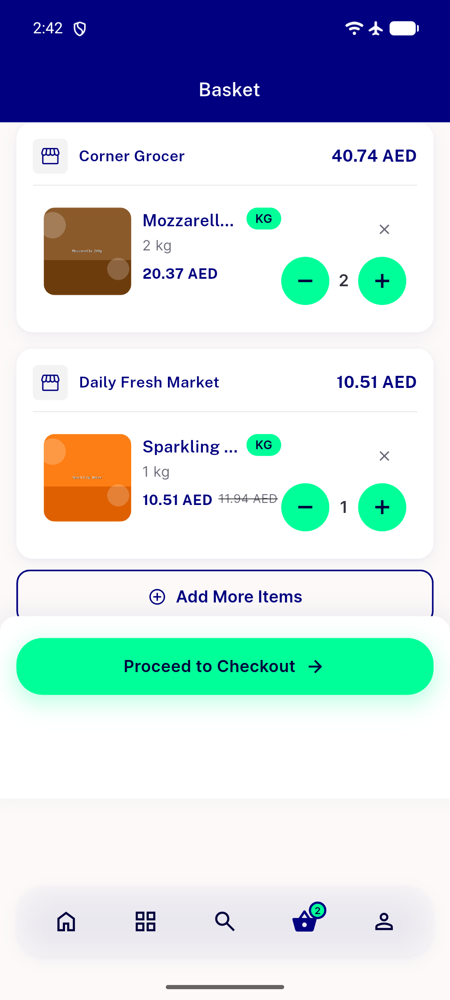
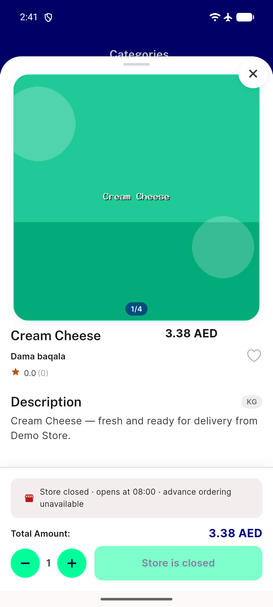
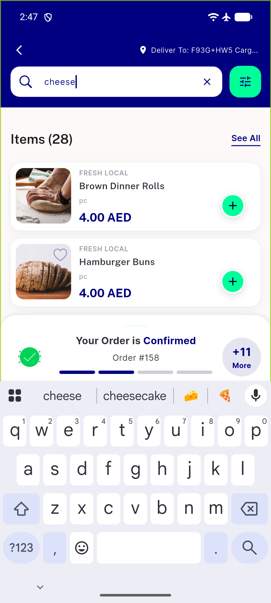

# QA Evidence — NEARS-2598

**PASS - NEARS-2598 44dp tap-target floor live QA: AC1-4 demonstrated on-device, narrow-card + RTL regression sweep clean, halal-tag overlap unverifiable (Data DoR gap, zero seed stores have halal_tag_status=1)**

**6 screenshot(s).** Click any thumbnail for full resolution.

<table>
<tr>
<td align="center" width="33%"> ac1 ac2 narrow grid 150dp light</td>
<td align="center" width="33%"> ac1 store card favourite</td>
<td align="center" width="33%"> ac3 cart item stepper</td>
</tr>
<tr>
<td align="center" width="33%"> ac3 item bottom sheet stepper</td>
<td align="center" width="33%"> regression narrow grid rtl</td>
<td align="center" width="33%"> regression search row cards</td>
</tr>
</table>

---
*From `nears/docs/qa-evidence/NEARS-2598/` · public-repo scrub policy (no live secrets; verified clean).*
